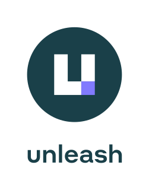
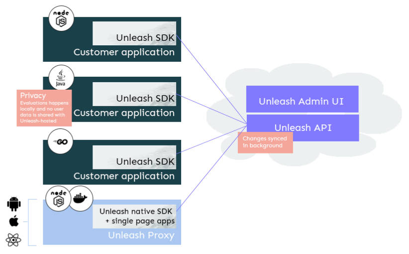
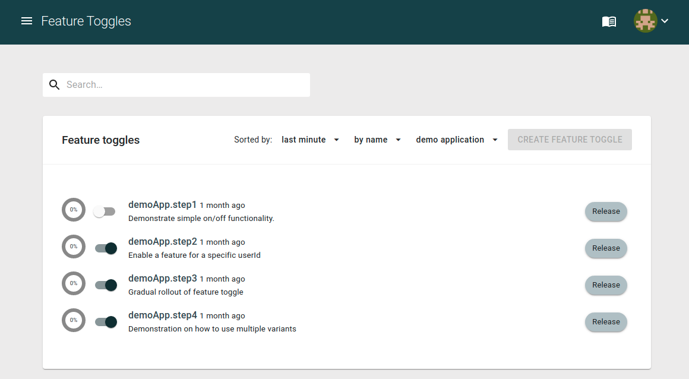

<div align="center">

 [](https://coveralls.io/github/Unleash/unleash?branch=master) [](https://www.npmjs.com/package/unleash-server) [](https://hub.docker.com/r/unleashorg/unleash-server)

[](https://www.heroku.com/deploy/?template=https://github.com/Unleash/unleash) [](https://cloud.digitalocean.com/apps/new?repo=https://github.com/Unleash/unleash/tree/master&refcode=0e1d75187044) [](https://twitter.com/intent/follow?screen_name=getunleash)


<a href="https://getunleash.io" title="Unleash - Create with freedom. Release with confidence">
    
</a>

</div>

Unleash is an open-source feature management platform. It provides a great overview of all feature toggles/flags across all your applications and services. Unleash enables software teams all over the world to take full control of how they enabled new functionality to end-users.

Unleash comes with [official client SDKs](https://docs.getunleash.io/sdks) for all the popular languages.

## Features

**Open-Source**

- Boolean feature toggles (on/off)
- Canary release (Gradual rollout)
- Targeted release
- Experimentation (A/B testing)
- Kill Switches
- Custom activation strategies
- Privacy first (GDPR) where end-user data never leaves your application
- Audit logs
- Addons integrating with other popular tools (Slack, Teams, Datadog, etc.)
- It is secure (Enable Secure Headers with strict HTTPS only mode)
- Extremely scalable with evaluations on the client-side. Used in enterprises handling more than 10k req/s. [Read more about our architecture](https://docs.getunleash.io/)
- Dashboard to manage technical debt
- Admin APIs
- Flexible architecture and can be hosted anywhere
- [Docker image available](https://hub.docker.com/r/unleashorg/unleash-server)

**Enterprise**

[Unleash Enterprise](https://www.getunleash.io/plans) builds directly on top of the Open-Source (open-core) and provides additional advanced functionality:

- Project support
- Advanced segmentation
- Environments (unlimited)
- SSO (SAML 2.0, OpenID Connect, etc)
- A cloud offering where the Unleash team host, monitor, scale, patches, upgrades and take full backups for you
- Self-hosted possible
- SLA guarantees
- Support

## Unleash SDKs

In order to connect your application to Unleash you need to use a client SDK for your programming language.

**Official Server SDKs**:

- [Java SDK](https://docs.getunleash.io/sdks/java_sdk)
- [Node.js SDK](https://docs.getunleash.io/sdks/node_sdk)
- [Go SDK](https://docs.getunleash.io/sdks/go_sdk)
- [Ruby SDK](https://docs.getunleash.io/sdks/ruby_sdk)
- [Python SDK](https://docs.getunleash.io/sdks/python_sdk)
- [.NET SDK](https://docs.getunleash.io/sdks/dot_net_sdk)
- [PHP SDK](https://docs.getunleash.io/sdks/php_sdk)

**Official Frontend SDKs:**

The frontend SDKs connects via the [Unleash Proxy](https://docs.getunleash.io/sdks/unleash-proxy) in order to ensure Privacy, scalability and security.

- [Javascript SDK](https://docs.getunleash.io/sdks/proxy-javascript)
- [React SDK](https://docs.getunleash.io/sdks/proxy-react)
- [Android SDK](https://docs.getunleash.io/sdks/android_proxy_sdk)
- [iOS SDK](https://docs.getunleash.io/sdks/proxy-ios)

**Community SDKs**

In addition there exists a good list of [community developed SDKs](https://docs.getunleash.io/sdks/community), so there might already exist an implementation for your favorite programming language (e.g. [Rust](https://github.com/cognitedata/unleash-client-rust), [Elixir](https://gitlab.com/afontaine/unleash_ex), [Dart](https://pub.dev/packages/unleash), [Clojure](https://github.com/AppsFlyer/unleash-client-clojure), [NestJS](https://github.com/pmb0/nestjs-unleash), [Kotlin](https://github.com/silvercar/unleash-client-kotlin), [PHP](https://gitlab.com/minds/unleash-client-php) and more.)

## Architecture



[Read more in the Unleash documentation](https://docs.getunleash.io/)

## What is a feature toggle?

The main motivation for doing feature toggling is to decouple the process for deploying code to production and releasing new features. This helps reducing risk, and allow us to easily manage which features to enable, and have full control of how we exposed the new feature for.

> Feature toggles decouple **deployment** of code from **release** of new features

This repo contains the unleash-server, which contains the Unleash Admin UI and the Unleash API. To make use of unleash you will also need a client SDK.



[Online demo](https://app.unleash-hosted.com/demo)

## Segmentation

It's fine to have a system for turning stuff on and off. But sometimes we want more granular control, we want to decide who the toggle should be enabled for. This is where activation strategies come into the picture. Activation strategies take arbitrary config and allow us to enable a toggle to a specific subset of your users (segment).

Common activation strategies includes:

- Active For users with a specified userId
- GradualRollout to X-percent of our users
- Active for our beta users
- Active only for application instances running on host x.

Read more about [activation strategies in our docs](https://docs.getunleash.io/docs/user_guide/activation_strategy).

## The Client API

The [client SDKs](https://docs.getunleash.io/sdks) provides a simple abstraction making it easy to check feature toggles in your application. The code snippet below shows how you would use `Unleash` in Java.

```java
if (unleash.isEnabled("AwesomeFeature")) {
  //do some magic
} else {
  //do old boring stuff
}
```

# Running Unleash

The are numbers of ways you can run Unleash.

1. Unleash Enterprise - Cloud hosted by the Unleash Team. [see plans](https://www.getunleash.io/plans)
2. Unleash Open-Source - Self host with Docker. [Guide](https://docs.getunleash.io/deploy/getting_started#start-unleash-server)
3. Unleash Open-Source - Self host with Node.js [Guide](https://docs.getunleash.io/deploy/getting_started#start-unleash-server)
4. Unleash Open-Source - Helm chart [artifacthub.io](https://artifacthub.io/packages/helm/unleash/unleash)

### Run from Docker

1. Create a network by running the following command:

```sh
docker network create unleash
```

2. Start a postgres database:

```sh
docker run -e POSTGRES_PASSWORD=some_password \
  -e POSTGRES_USER=unleash_user -e POSTGRES_DB=unleash \
  --network unleash --name postgres postgres
```

3. Start Unleash via docker:

```sh
docker run -p 4242:4242 \
  -e DATABASE_HOST=postgres -e DATABASE_NAME=unleash \
  -e DATABASE_USERNAME=unleash_user -e DATABASE_PASSWORD=some_password \
  -e DATABASE_SSL=false \
  --network unleash unleashorg/unleash-server
```

The first time Unleash starts it will create a default user which you can use to sign-in to your Unleash instance and add more users with:

- username: `admin`
- password: `unleash4all`

# Users of Unleash

Unleash is trusted by thousands of companies all over the world (we are tracking more than 90 countries already). Proud Open-Source users:

<a href="https://www.nav.no" title="NAV.no"></a> <a href="https://www.otovo.com" title="Otovo"></a> <a href="https://www.amedia.no/" title="Amedia"></a> <a href="https://budgets.money" title="Budgets"></a> <a href="https://www.finn.no" title="FINN.no"></a>

_(PS! feel free to submit your logo!)_

# Contribute to Unleash

Unleash has been built with the help of many smart individuals. This ensures that we build a product that solves real problems for people. If you want to contribute to this project you are encouraged to send issue requests, or provide pull-requests.

1. Read [CONTRIBUTING.md](./CONTRIBUTING.md) to learn more on how you can contribute
1. Browse the [developer-guide](./website/docs/contributing/developer-guide.md) for tips on environment setup, running the tests, and running Unleash from source.

# Community and Help

We know that learning a new tool can be hard and time-consuming. We have a growing community that loves to help out. Please don't hesitate about reaching out to get help.

- [Join Unleash on Slack](https://join.slack.com/t/unleash-community/shared_invite/enQtNjUxMjU2MDc0MTAxLTJjYmViYjkwYmE0ODVlNmY1YjcwZGRmZWU5MTU1YTQ1Nzg5ZWQ2YzBlY2U1MjlmZDg5ZDRmZTMzNmQ5YmEyOGE) if you want ask open questions about Unleash, feature toggling or discuss these topics in general.
- [Create a issue request](https://github.com/Unleash/unleash/issues/new) if you have found a bug or have ideas on how to improve Unleash.
- [Follow Unleash on Twitter](https://twitter.com/getunleash) if you want to stay updated on the latest progress of the Unleash project.

# In the media
- [Free Code Camp: Feature toggles - Why and how to add to your software](https://www.youtube.com/watch?v=-yHZ9uLVSp4)
- [Feature toggling transient errors in load tests](https://nrkbeta.no/2021/08/23/feature-toggling-transient-errors-in-load-tests/) (English)
- [The Code Kitchen Episode 7: Feature flags with Unleash](https://share.fireside.fm/episode/zD-4e4KI+Pr379KBv) (English)
- [Utviklerpodden, 1 - Feature Flags og Unleash med Fredrik Oseberg](https://pod.space/utviklerpodden/feature-flags-og-unleash-med-fredrik-oseberg) (Norwegian)
- [Node Weekly issue 380](https://nodeweekly.com/issues/380)
- [Console 42 - The open-source newsletter](https://console.substack.com/p/console-42)
- [This Week in Rust 340](https://this-week-in-rust.org/blog/2020/05/27/this-week-in-rust-340/)
- [Unleash-hosted - Unleash as a Service](https://www.unleash-hosted.com)
- [Medium blog](https://medium.com/unleash-hosted)
- [Blog: Unleash your features gradually!](http://bytes.schibsted.com/unleash-features-gradually/)
- [Presentation: Unleash your features gradually!](http://ivarconr.github.io/feature-toggles-presentation/sch-dev-lunch-2017/#1)
- http://martinfowler.com/bliki/FeatureToggle.html
