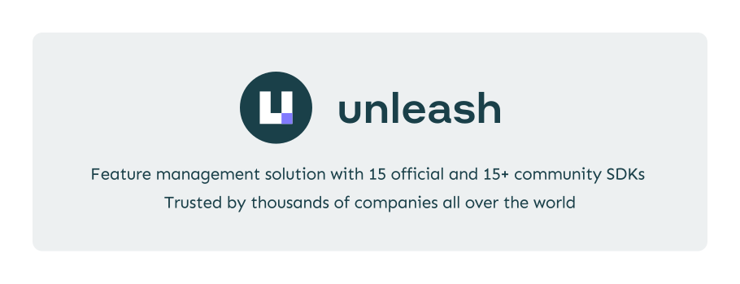
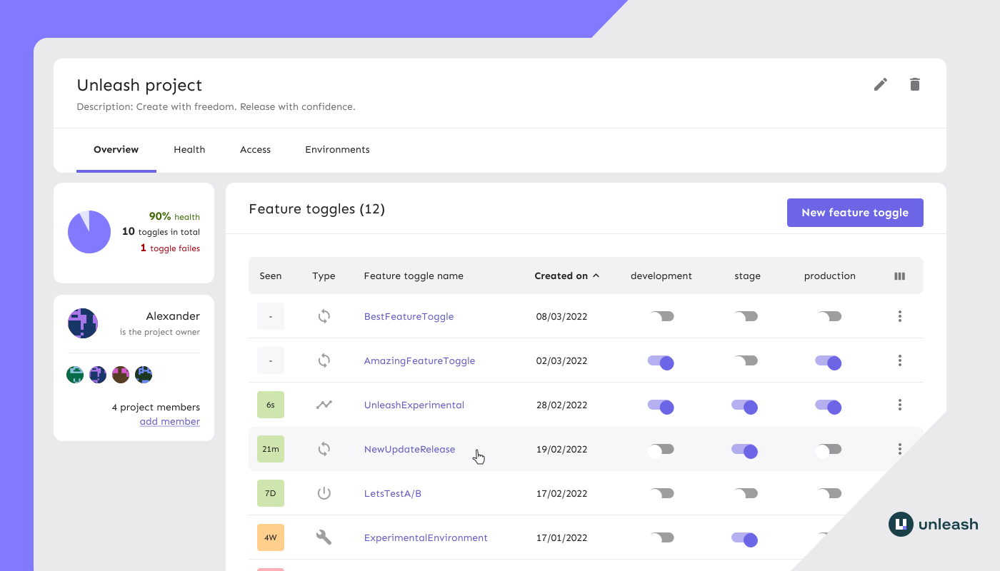
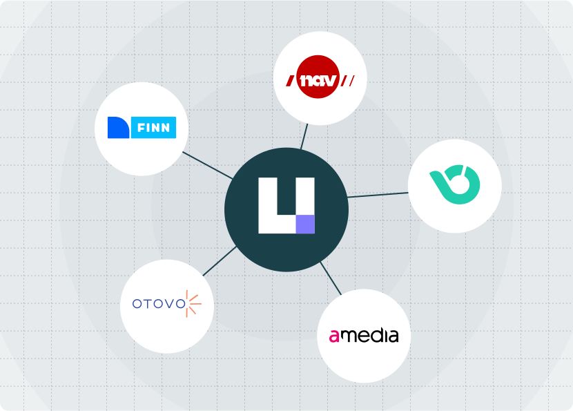

<div align="center">

## 🚀 Unleash 4.16 brings powerful Constraints feature to OSS users. [Read more →](https://www.getunleash.io/blog/unleash-brings-powerful-constraints-feature-to-oss-users?utm_source=github&utm_medium=community&utm_campaign=constraints_04102026)

<a href="https://getunleash.io" title="Unleash - Create with freedom. Release with confidence">
    
</a>

<br/>
<br/>

[](https://github.com/Unleash/unleash/actions/workflows/build.yaml) [](https://coveralls.io/github/Unleash/unleash?branch=main) [](https://hub.docker.com/r/unleashorg/unleash-server) [](https://github.com/Unleash/unleash/blob/main/LICENSE) [](https://slack.unleash.run)

[Open Live Demo →](https://www.getunleash.io/interactive-demo)

</div>

## About Unleash

Unleash is an open source feature management solution. It improves the workflow of your development team and leads to quicker software delivery. Unleash increases efficiency and gives teams _full control_ of how and when they enable new functionality for end users. Unleash lets teams ship code to production in _smaller_ releases _whenever_ they want.

Feature toggles make it easy to test how your code works with real production data without the fear that you'll accidentally break your users' experience. It also helps your team work on multiple features in parallel without each maintaining an separate feature branch.

Unleash is the largest open source solution for feature flagging on GitHub. There's 12 official client and server SDKs and 10+ community SDKs available; you can even make your own if you want to. You can use Unleash with any language and any framework.

<br/>

## Get started in 2 steps

### 1. Start Unleash

With [`git`](https://git-scm.com/) and [`docker`](https://www.docker.com/) installed, it's easy to get started:

Run this script:

```bash
git clone git@github.com:Unleash/unleash-docker.git
cd unleash-docker
docker compose up -d
```

Then point your browser to `localhost:4242` and log in using:

- username: `admin`
- password: `unleash4all`

If you'd rather run the source code in this repo directly via Node.js, see the [step-by-step instructions to get up and running in the contributing guide](./CONTRIBUTING.md#how-to-run-the-project).

### 2. Connect your SDK

Find your preferred SDK in [our list of official SDKs](#unleash-sdks) and import it into your project. Follow the setup guides for your specific SDK.

If you use the docker compose file from the previous step, here's the configuration details you'll need to get going:

- For front-end SDKs, use:
  - URL: `http://localhost:3000`
  - `clientKey`: `proxy-client-key`
- For server-side SDKs, use:
  - Unleash API URL: `http://localhost:4242/api/`
  - API token: `default:development.unleash-insecure-api-token`

If you use a different setup, your configuration details will most likely also be different.

### Check a feature toggle

Checking the state of a feature toggle in your code is easy! The syntax will vary depending on your language, but all you need is a simple function call to check whether a toggle is available. Here's how it might look in Java:

```java
if (unleash.isEnabled("AwesomeFeature")) {
  // do new, flashy thing
} else {
  // do old, boring stuff
}
```

### Run Unleash on a service?

If you don't want to run Unleash locally, we also provide easy deployment setups for Heroku and Digital Ocean:

[](https://www.heroku.com/deploy/?template=https://github.com/Unleash/unleash) [](https://cloud.digitalocean.com/apps/new?repo=https://github.com/Unleash/unleash/tree/main&refcode=0e1d75187044)

### Configure and run Unleash anywhere

The above sections show you how to get up and running quickly and easily. When you're ready to start configuring and customizing Unleash for your own environment, check out the documentation for [getting started with self-managed deployments](https://docs.getunleash.io/deploy/getting_started), [Unleash configuration options](https://docs.getunleash.io/deploy/configuring_unleash), or [running Unleash locally via docker](https://docs.getunleash.io/user_guide/quickstart#i-want-to-run-unleash-locally).

<br/>

## Online demo

Try out [the Unleash online demo](https://www.getunleash.io/interactive-demo).

[](https://www.getunleash.io/interactive-demo)

<br/>

## Community and help — sharing is caring

We know that learning a new tool can be hard and time-consuming. We have a growing community that loves to help out. Please don't hesitate to reach out for help.

[](https://slack.unleash.run)

💬 [Join Unleash on Slack](https://slack.unleash.run) if you want ask open questions about Unleash, feature toggling or discuss these topics in general.

💻 [Create a GitHub issue](https://github.com/Unleash/unleash/issues/new) if you have found a bug or have ideas on how to improve Unleash.

📚 [Visit the documentation](https://docs.getunleash.io/) for more in-depth descriptions, how-to guides, and more.

<br/>

## Contribute to Unleash

Building Unleash is a collaborative effort, and we owe a lot of gratitude to many smart and talented individuals. Building it together with community ensures that we build a product that solves real problems for real people. We'd love to have your help too: Please feel free to open issues or provide pull requests.

Check out [the CONTRIBUTING.md file](./CONTRIBUTING.md) for contribution guidelines and the [Unleash developer guide](./website/docs/contributing/developer-guide.md) for tips on environment setup, running the tests, and running Unleash from source.

### Contributors

<div align="center">

[](https://github.com/Unleash/unleash/graphs/contributors)

</div>

<br/>

## Features our users love

### Flexibility and adaptability

- Get an easy overview of all feature toggles across all your environments, applications and services
- Use included [activation strategies](https://docs.getunleash.io/user_guide/activation_strategy) for most common use cases, or use a [custom activation strategy](https://docs.getunleash.io/advanced/custom_activation_strategy) to support any need you might have
- Organise feature toggles by [feature toggle tags](https://docs.getunleash.io/advanced/tags)
- [Canary releases / gradual rollouts](https://docs.getunleash.io/user_guide/activation_strategy#gradual-rollout)
- Targeted releases: release features to specific [users](https://docs.getunleash.io/user_guide/activation_strategy#userids), [IPs](https://docs.getunleash.io/user_guide/activation_strategy#ips), or [hostnames](https://docs.getunleash.io/user_guide/activation_strategy#hostnames)
- [Kill switches](https://docs.getunleash.io/advanced/feature_toggle_types#feature-toggle-types)
- [A/B testing](https://docs.getunleash.io/topics/a-b-testing)
- 2 [environments](https://docs.getunleash.io/user_guide/environments)
- Out-of-the-box integrations with popular tools ([Slack](https://docs.getunleash.io/addons/slack), [Microsoft Teams](https://docs.getunleash.io/addons/teams), [Datadog](https://docs.getunleash.io/addons/datadog)) + integrate with anything with [webhooks](https://docs.getunleash.io/addons/webhook)
- [Dashboard for managing technical debt](https://docs.getunleash.io/user_guide/technical_debt) and [stale toggles](https://docs.getunleash.io/user_guide/technical_debt#stale-and-potentially-stale-toggles)
- API-first: _everything_ can be automated. No exceptions.
- [12 official client SDKs](https://docs.getunleash.io/sdks#official-sdks), and ten [community-contributed client SDKs](https://docs.getunleash.io/sdks#community-sdks)
- Run it via Docker with the [official Docker image](https://hub.docker.com/r/unleashorg/unleash-server) or as a pure Node.js application

### Security and performance

- Privacy by design (GDPR and Schrems II). End-user data never leaves your application.
- [Audit logs](https://docs.getunleash.io/advanced/audit_log)
- Enforce [OWASP's secure headers](https://owasp.org/www-project-secure-headers/) via the strict HTTPS-only mode
- Flexible hosting options: host it on premise or in the cloud (_any_ cloud)
- Scale [the Unleash Proxy](https://docs.getunleash.io/sdks/unleash-proxy) independently of the Unleash server to support any number of front-end clients without overloading your Unleash instance

### Looking for more features?

If you're looking for one of the following features, please take a look at our [Pro and Enterprise plans](https://www.getunleash.io/plans):

- [role-based access control (RBAC)](https://docs.getunleash.io/user_guide/rbac)
- [single sign-on (SSO)](https://docs.getunleash.io/advanced/enterprise-authentication)
- more environments
- [feature toggles project support](https://docs.getunleash.io/user_guide/projects)
- [advanced segmentation](https://docs.getunleash.io/reference/segments)
- [additional strategy constraints](https://docs.getunleash.io/advanced/strategy_constraints)
- tighter security
- more hosting options (we can even host it for you!)

<br/>

## Architecture


Read more in the [_system overview_ section of the Unleash documentation](https://docs.getunleash.io/user_guide/unleash_overview#system-overview).

<br/>

## Unleash SDKs

To connect your application to Unleash you'll need to use a client SDK for your programming language.

**Official server-side SDKs:**

- [Go SDK](https://docs.getunleash.io/sdks/go_sdk)
- [Java SDK](https://docs.getunleash.io/sdks/java_sdk)
- [Node.js SDK](https://docs.getunleash.io/sdks/node_sdk)
- [PHP SDK](https://docs.getunleash.io/sdks/php_sdk)
- [Python SDK](https://docs.getunleash.io/sdks/python_sdk)
- [Ruby SDK](https://docs.getunleash.io/sdks/ruby_sdk)
- [Rust SDK](https://github.com/unleash/unleash-client-rust)
- [.NET SDK](https://docs.getunleash.io/sdks/dot_net_sdk)

**Official front-end SDKs:**

The front-end SDKs connects via the [Unleash Proxy](https://docs.getunleash.io/sdks/unleash-proxy) in order to ensure privacy, scalability and security.

- [Android Proxy SDK](https://docs.getunleash.io/sdks/android_proxy_sdk)
- [iOS Proxy SDK](https://docs.getunleash.io/sdks/proxy-ios)
- [JavaScript Proxy SDK](https://docs.getunleash.io/sdks/proxy-javascript)
- [React Proxy SDK](https://docs.getunleash.io/sdks/proxy-react)
- [Svelte Proxy SDK](https://docs.getunleash.io/sdks/proxy-svelte)
- [Vue Proxy SDK](https://docs.getunleash.io/sdks/proxy-vue)

**Community SDKs:**

If none of the official SDKs fit your need, there's also a number of [community-developed SDKs](https://docs.getunleash.io/sdks#community-sdks) where you might find an implementation for your preferred language (such as [Elixir](https://gitlab.com/afontaine/unleash_ex), [Dart](https://pub.dev/packages/unleash), [Clojure](https://github.com/AppsFlyer/unleash-client-clojure), and more).

<br/>

## Users of Unleash

**Unleash is trusted by thousands of companies all over the world**.

**Proud Open-Source users:** (send us a message if you want to add your logo here)



<br/>

## Migration guides

Unleash has evolved significantly over the past few years, and we know how hard it can be to keep software up to date. If you're using the current major version, upgrading shouldn't be an issue. If you're on a previous major version, check out the [Unleash migration guide](https://docs.getunleash.io/deploy/migration_guide)!

<br/>

## Want to know more about Unleash?

### Videos and podcasts

- [The Unleash YouTube channel](https://www.youtube.com/channel/UCJjGVOc5QBbEje-r7nZEa4A)
- [_Feature toggles — Why and how to add to your software_ — freeCodeCamp (YouTube)](https://www.youtube.com/watch?v=-yHZ9uLVSp4&t=0s)
- [_Feature flags with Unleash_ — The Code Kitchen (podcast)](https://share.fireside.fm/episode/zD-4e4KI+Pr379KBv)
- [_Feature Flags og Unleash med Fredrik Oseberg_ — Utviklerpodden (podcast; Norwegian)](https://pod.space/utviklerpodden/feature-flags-og-unleash-med-fredrik-oseberg)

### Articles and more

- [The Unleash Blog](https://www.getunleash.io/blog)
- [_Designing the Rust Unleash API client_ — Medium](https://medium.com/cognite/designing-the-rust-unleash-api-client-6809c95aa568)
- [_FeatureToggle_ by Martin Fowler](http://martinfowler.com/bliki/FeatureToggle.html)
- [_Feature toggling transient errors in load tests_ — nrkbeta](https://nrkbeta.no/2021/08/23/feature-toggling-transient-errors-in-load-tests/)
- [_An Interview with Ivar of Unleash_ — Console](https://console.substack.com/p/console-42)
- [_Unleash your features gradually_](http://ivarconr.github.io/feature-toggles-presentation/sch-dev-lunch-2017/#1 ' '), slideshow/presentation by Ivar, the creator of Unleash
