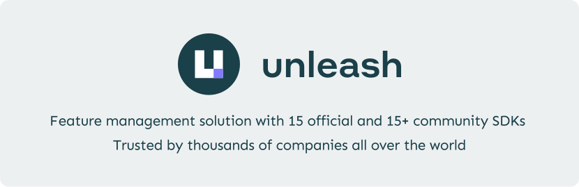

<div align="center">

<a href="https://getunleash.io" title="Unleash - Empowering developers to release with confidence">
    
</a>

<br/>
<br/>

[](https://github.com/Unleash/unleash/actions/workflows/build.yaml) [](https://github.com/Unleash/unleash/actions/workflows/build_coverage.yaml) [](https://hub.docker.com/r/unleashorg/unleash-server) [](https://github.com/Unleash/unleash/blob/main/LICENSE) [](https://slack.unleash.run)

[Launch the live demo](https://www.getunleash.io/interactive-demo?utm_source=readme&utm_medium=oss&utm_content=top-cta) | [Try Unleash Enterprise for free](https://www.getunleash.io/plans/enterprise-payg?utm_source=readme&utm_medium=oss&utm_content=top-cta)

</div>

## What is Unleash?

Unleash is a powerful open-source solution for feature management. It streamlines your development workflow, accelerates software delivery, and empowers teams to control how and when they roll out new features to end users. With Unleash, you can deploy code to production in smaller, more manageable releases at your own pace.

Feature flags in Unleash let you test your code with real production data, reducing the risk of negatively impacting your users' experience. It also enables your team to work on multiple features simultaneously without the need for separate feature branches.

Unleash is the most popular open-source solution for feature flagging on GitHub. It supports 15 official client and server SDKs and over 15 community SDKs. You can even create your own SDK if you wish. Unleash is compatible with any language and framework.

<br/>

## Get started with Unleash

### Set up Unleash

To get started with Unleash, you can either explore [Unleash Enterprise](#unleash-enterprise) with a free trial or [get started locally](#unleash-open-source) with our open-source solution.

#### Unleash Enterprise

To start with Unleash Enterprise, [request a free trial](https://www.getunleash.io/plans/enterprise-payg?utm_source=oss&utm_medium=readme&utm_content=unleash-enterprise-start). This gives you access to a hosted instance with unlimited projects and environments and features such as [role-based access control](https://docs.getunleash.io/reference/rbac), [change requests](https://docs.getunleash.io/reference/change-requests), [single sign-on](https://docs.getunleash.io/reference/sso), and [SCIM](https://docs.getunleash.io/reference/scim) for automatic user provisioning.

#### Unleash Open Source

To set up Unleash locally, you'll need [`git`](https://git-scm.com/) and [`docker`](https://www.docker.com/) installed on your machine.

Execute the following commands:

```bash
git clone git@github.com:Unleash/unleash.git
cd unleash
docker compose up -d
```

Then point your browser to `localhost:4242` and log in using:

- username: `admin`
- password: `unleash4all`

If you'd rather run the source code in this repo directly via Node.js, see the [step-by-step instructions to get up and running in the contributing guide](./CONTRIBUTING.md#how-to-run-the-project).

### Connect your SDK

Find your preferred SDK in [our list of official SDKs](#unleash-sdks) and import it into your project. Follow the setup guides for your specific SDK.

If you use the docker compose file from the previous step, here's the configuration details you'll need to get going:

- For frontend SDKs, use:
  - URL: `http://localhost:4242/api/frontend/`
  - `clientKey`: `default:development.unleash-insecure-frontend-api-token`
- For backend SDKs, use:
  - Unleash API URL: `http://localhost:4242/api/`
  - API token: `default:development.unleash-insecure-api-token`

If you use a different setup, your configuration details will most likely also be different.

### Check a feature flag

Checking the state of a feature flag in your code is easy! The syntax will vary depending on your language, but all you need is a simple function call to check whether a flag is available. Here's how it might look in Java:

```java
if (unleash.isEnabled("AwesomeFeature")) {
  // do new, flashy thing
} else {
  // do old, boring stuff
}
```
## Try Unleash in the cloud

Want to explore Unleash without setting it up locally? Here are two easy ways to see it in action.

### Live demo
Open a running Unleash environment in your browser with no signup or setup required. This shared demo instance includes the core functionality so you can quickly get a feel for how Unleash works.

**→ [Launch the live demo](https://www.getunleash.io/interactive-demo?utm_source=readme&utm_medium=oss&utm_content=demo-section-cta)**

[](https://www.getunleash.io/interactive-demo?utm_source=readme&utm_medium=oss&utm_content=demo-section-cta)

### Free Enterprise trial
Get your own dedicated instance with a free 14-day cloud trial. This includes the full Unleash Enterprise feature set; ideal when evaluating Unleash for production use.  

**→ [Start your free trial](https://www.getunleash.io/plans/enterprise-payg?utm_source=readme&utm_medium=oss&utm_content=demo-section-cta)**

<br/>

## Deploying to a production server

To self-host Unleash in a production environment, you need to deploy it to a persistent server. 

We provide guides for deploying to services like Heroku and DigitalOcean:

[](https://www.heroku.com/deploy/?template=https://github.com/Unleash/unleash) [](https://cloud.digitalocean.com/apps/new?repo=https://github.com/Unleash/unleash/tree/main&refcode=0e1d75187044)

For more advanced configurations options, check out our documentation on:
- [Getting started with self-hosting](https://docs.getunleash.io/reference/deploy/getting-started)
- [Unleash configuration options](https://docs.getunleash.io/reference/deploy/configuring-unleash)

<br/>

## Community and help

We know that learning a new tool can be hard and time-consuming. We have a growing community that loves to help out. Please don't hesitate to reach out for help.

[](https://slack.unleash.run)

💬 [Join Unleash on Slack](https://slack.unleash.run) if you want ask open questions about Unleash, feature toggling or discuss these topics in general.

💻 [Create a GitHub issue](https://github.com/Unleash/unleash/issues/new) if you have found a bug or have ideas on how to improve Unleash.

📚 [Visit the documentation](https://docs.getunleash.io/) for more in-depth descriptions, how-to guides, and more.

📖 Learn more about the principles of building and scaling [feature flag](https://docs.getunleash.io/guides/feature-flag-best-practices) solutions.

<br/>

## Contribute to Unleash

Unleash is the largest [open-source feature flag solution](https://www.getunleash.io/) on GitHub. Building Unleash is a collaborative effort, and we owe a lot of gratitude to many smart and talented individuals. Building it together with the community ensures that we build a product that solves real problems for real people. We'd love to have your help too: Please feel free to open issues or provide pull requests.

Check out [the CONTRIBUTING.md file](./CONTRIBUTING.md) for contribution guidelines and the [Unleash developer guide](./website/docs/contributing/developer-guide.md) for tips on environment setup, running the tests, and running Unleash from source.

### Contributors

<div align="center">

[](https://github.com/Unleash/unleash/graphs/contributors)

</div>

<br/>

## Features our users love

### Flexibility and adaptability

- Get an overview of all feature flags across all your environments, applications and services
- Targeted releases using [activation strategies](https://docs.getunleash.io/reference/activation-strategies) to enable and disable features for certain users or segments without having to redeploy your application.
- [Canary releases / gradual rollouts](https://docs.getunleash.io/reference/activation-strategies)
- [Kill switches](https://docs.getunleash.io/reference/feature-toggles#feature-flag-types)
- [A/B testing](https://docs.getunleash.io/feature-flag-tutorials/use-cases/a-b-testing)
- 2 [environments](https://docs.getunleash.io/reference/environments)
- Organize feature flags using [tags](https://docs.getunleash.io/reference/feature-toggles#tags)
- Out-of-the-box integrations with popular tools ([Slack](https://docs.getunleash.io/addons/slack), [Microsoft Teams](https://docs.getunleash.io/addons/teams), [Datadog](https://docs.getunleash.io/addons/datadog)) + integrate with anything with [webhooks](https://docs.getunleash.io/addons/webhook)
- [Insights for managing technical debt](https://docs.getunleash.io/reference/technical-debt) and [stale flags](https://docs.getunleash.io/reference/technical-debt#stale-and-potentially-stale-flags)
- API-first: _everything_ can be automated. No exceptions.
- [12 official SDKs](https://docs.getunleash.io/reference/sdks#official-sdks), and 10 [community-contributed SDKs](https://docs.getunleash.io/reference/sdks#community-sdks)
- Run it via Docker with the [official Docker image](https://hub.docker.com/r/unleashorg/unleash-server) or as a pure Node.js application

### Security and performance

- Privacy by design (GDPR and Schrems II). End-user data never leaves your application.
- [Audit logs](https://docs.getunleash.io/advanced/audit_log)
- Enforce [OWASP's secure headers](https://owasp.org/www-project-secure-headers/) via the strict HTTPS-only mode
- Flexible hosting options: host it on premise or in the cloud (_any_ cloud)
- Scale with [Unleash Edge](https://docs.getunleash.io/reference/unleash-edge) independently of the Unleash server to support any number of frontend clients without overloading your Unleash instance

### Looking for more features?

If you're looking for one of the following features, please take a look at our [Pro and Enterprise plans](https://www.getunleash.io/plans):

- [role-based access control (RBAC)](https://docs.getunleash.io/reference/rbac)
- [single sign-on (SSO)](https://docs.getunleash.io/reference/sso)
- more environments
- [feature flags project support](https://docs.getunleash.io/reference/projects)
- [advanced segmentation](https://docs.getunleash.io/reference/segments)
- [additional strategy constraints](https://docs.getunleash.io/reference/activation-strategies#constraints)
- tighter security
- more hosting options (we can even host it for you!)

<br/>

## Architecture


Read more in the [_system overview_ section of the Unleash documentation](https://docs.getunleash.io/get-started/unleash-overview#system-overview).

<br/>

## Unleash SDKs

To connect your application to Unleash you'll need to use a client SDK for your programming language.

**Official backend SDKs:**

- [Go SDK](https://docs.getunleash.io/reference/sdks/go)
- [Java SDK](https://docs.getunleash.io/reference/sdks/java)
- [Node.js SDK](https://docs.getunleash.io/reference/sdks/node)
- [PHP SDK](https://docs.getunleash.io/reference/sdks/php)
- [Python SDK](https://docs.getunleash.io/reference/sdks/python)
- [Ruby SDK](https://docs.getunleash.io/reference/sdks/ruby)
- [Rust SDK](https://github.com/unleash/unleash-client-rust)
- [.NET SDK](https://docs.getunleash.io/reference/sdks/dotnet)

**Official frontend SDKs:**

- [Android Proxy SDK](https://docs.getunleash.io/reference/sdks/android-proxy)
- [Flutter Proxy SDK](https://docs.getunleash.io/reference/sdks/flutter)
- [iOS Proxy SDK](https://docs.getunleash.io/reference/sdks/ios-proxy)
- [JavaScript Proxy SDK](https://docs.getunleash.io/reference/sdks/javascript-browser)
- [React Proxy SDK](https://docs.getunleash.io/reference/sdks/react)
- [Svelte Proxy SDK](https://docs.getunleash.io/reference/sdks/svelte)
- [Vue Proxy SDK](https://docs.getunleash.io/reference/sdks/vue)

**Community SDKs:**

If none of the official SDKs fit your need, there's also a number of [community-developed SDKs](https://docs.getunleash.io/reference/sdks#community-sdks) where you might find an implementation for your preferred language (such as [Elixir](https://gitlab.com/afontaine/unleash_ex), [Dart](https://pub.dev/packages/unleash), [Clojure](https://github.com/AppsFlyer/unleash-client-clojure), and more).

<br/>

## Users of Unleash

**Unleash is trusted by thousands of companies all over the world**.

**Proud Open-Source users:** (send us a message if you want to add your logo here)


<br/>

## Migration guides

Unleash has evolved significantly over the past few years, and we know how hard it can be to keep software up to date. If you're using the current major version, upgrading shouldn't be an issue. If you're on a previous major version, check out the [Unleash migration guide](https://docs.getunleash.io/deploy/migration_guide)!

<br/>

## Want to know more about Unleash?

### Videos and podcasts

- [The Unleash YouTube channel](https://www.youtube.com/channel/UCJjGVOc5QBbEje-r7nZEa4A)
- [_Feature toggles — Why and how to add to your software_ — freeCodeCamp (YouTube)](https://www.youtube.com/watch?v=-yHZ9uLVSp4&t=0s)
- [_Feature flags with Unleash_ — The Code Kitchen (podcast)](https://share.fireside.fm/episode/zD-4e4KI+Pr379KBv)
- [_Feature Flags og Unleash med Fredrik Oseberg_ — Utviklerpodden (podcast; Norwegian)](https://pod.space/utviklerpodden/feature-flags-og-unleash-med-fredrik-oseberg)

### Articles and more

- [The Unleash Blog](https://www.getunleash.io/blog)
- [_Designing the Rust Unleash API client_ — Medium](https://medium.com/cognite/designing-the-rust-unleash-api-client-6809c95aa568)
- [_FeatureToggle_ by Martin Fowler](http://martinfowler.com/bliki/FeatureToggle.html)
- [_Feature toggling transient errors in load tests_ — nrkbeta](https://nrkbeta.no/2021/08/23/feature-toggling-transient-errors-in-load-tests/)
- [_An Interview with Ivar of Unleash_ — Console](https://console.substack.com/p/console-42)
- [_Unleash your features gradually_](http://ivarconr.github.io/feature-toggles-presentation/sch-dev-lunch-2017/#1 ' '), slideshow/presentation by Ivar, the creator of Unleash
