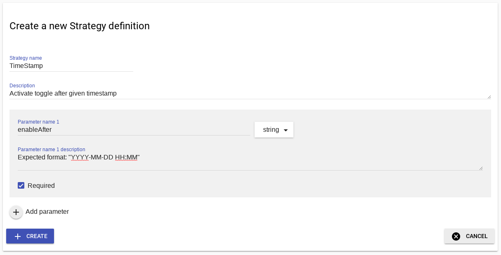
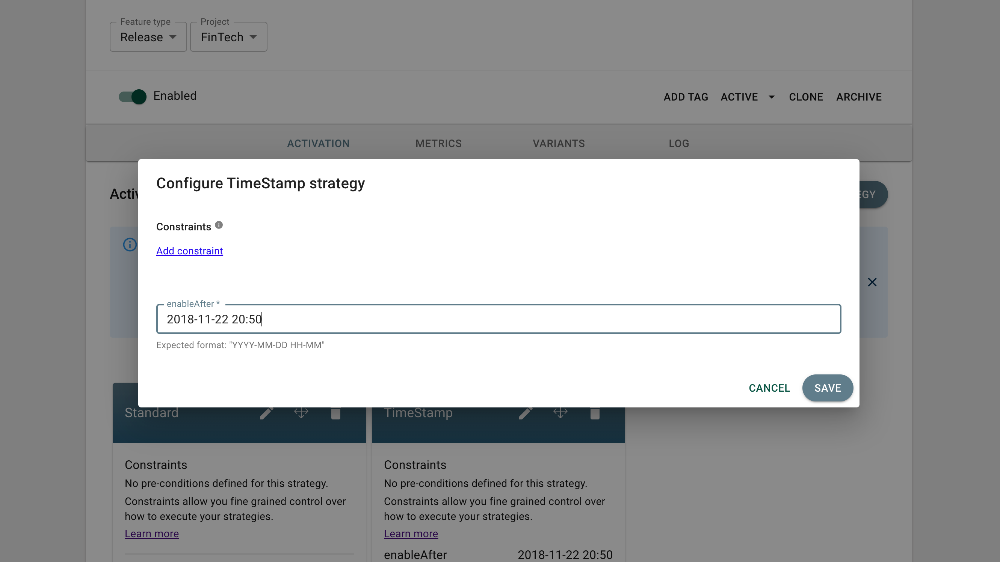

Even though Unleash comes with a few powerful [build in activation strategies](activation-strategies.md) there might be scenarios where you would like to extend Unleash with your own custom strategies.

### Example: TimeStamp Strategy

In this example we want to define an activation strategy where we want a feature toggle to be activated after a given date and time.

#### Define custom strategy

First we need to "define" our new strategy. You can do that under the "Strategy" section the the Unleash Admin UI.



We name our strategy `TimeStamp` and add one required paramter of type string, which we call `enableAfter`.

#### Use custom strategy

After we have have created the strategy definition, we can now decide to use that activation strategy for our feature toggle.



In the example we want to use our custom strategy for the feature toggle named `demo.TimeStampRollout`.

#### Client implemenation

For the clients to understand the new custom strategy we need to implement the logic to understand the new custom strategy. All official client SDK's for Unleash provides abstractions for you to implement your own custom strategies.

> Before you have provided support for the custom strategy; the client will return false, because it does not understand the activation strategy.

In Node.js the implementation for the `TimeStampStrategy` would be:

```javascript
class TimeStampStrategy extends Strategy {
  constructor() {
    super('TimeStamp');
  }

  isEnabled(parameters, context) {
    const enableAfterTimeStamp = moment(parameters.enableAfter);
    return moment().isAfter(enableAfterTimeStamp);
  }
}
```

In the example implemenation we make use of the libarary called moment to parse the timestamp and verify that current time is after the specified `enabledAfter` parameter.

We also have to remember to register the custom strategy when initalizing the Unleash client. Full working code example:

```javascript
const moment = require('moment');
const { Strategy, initialize, isEnabled } = require('unleash-client');

class TimeStampStrategy extends Strategy {
  constructor() {
    super('TimeStamp');
  }

  isEnabled(parameters, context) {
    const enableAfterTimeStamp = moment(parameters.enableAfter);
    return moment().isAfter(enableAfterTimeStamp);
  }
}

const instance = initialize({
  url: 'http://unleash.herokuapp.com/api/',
  appName: 'unleash-demo',
  instanceId: '1',
  strategies: [new TimeStampStrategy()],
});

instance.on('ready', () => {
  setInterval(() => {
    console.log(isEnabled('demo.TimeStampRollout'));
  }, 1000);
});
```
