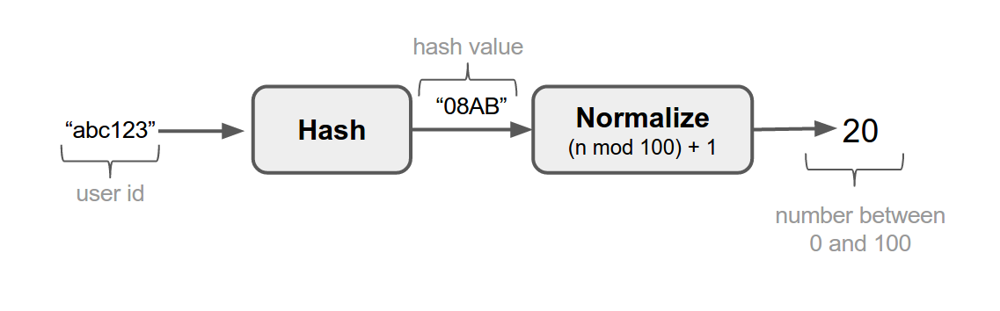

It is powerful to be able to turn a feature on and off instantaneously, without redeploying the application. The next level of control comes when you are able to enable a feature for specific users or enable it for a small subset of the users. We achieve this level of control with the help of activation strategies. The most simple strategy is the “default” strategy, which basically means that the feature should be enabled to everyone.

The definition of an activation strategy lives in the Unleash API and can be created via the Unleash UI. The implementation of activation strategies lives in the various client implementations. 

Unleash comes with a few common activation strategies. Some of them require the client to provide the [unleash-context](./unleash-context.md), which gives necessary context for unleash. 

## default
It is the simplest activation strategy and basically means "active for everyone".

## userWithId
Active for users with a userId defined in the userIds-list. Typically I want to enable a new feature only for myself in production, before I enable it for everyone else. To achieve this we can use the “UserWithIdStrategy”. This strategy allows you to specify a list of user ids that you want to expose the new feature for. (A user id may of course be an email if that is more appropriate in your system.)

**Parameters**
- userIds - *List of user ids you want the feature toggle be enabled for*

## gradualRolloutUserId
Gradually activates feature toggle for logged in users. Stickiness based on the user id. 
This strategy guarantees that the same user gets the same experience every time, 
across devices. It also guarantees that a user which is among the first 10% will 
also be among the first 20% of the users. Thus we ensure that users get the same 
experience. Even if we gradually increase the number of users who are exposed to 
a particular feature. To achieve this we hash the user id and normalise the hash 
value to a number between 1 and 100 with a simple modulo operator. 

Starting from v3.x all clients should use the 32-bit [MurmurHash3](https://en.wikipedia.org/wiki/MurmurHash) algorithm to normalize values. 
([issue 247](https://github.com/Unleash/unleash/issues/247))

**Parameters**
- percentage - *The percentage (0-100) you want to enable the feature toggle for.*
- groupId - *Used to define an activation group, which allows you to correlate rollout across feature toggles.*

## gradualRolloutSessionId
Gradually activates feature toggle. Stickiness based on session id. It is almost 
identical to the `gradualRolloutUserId` strategy, with the exception that it works 
on session ids. This makes it possible to target all users (not just logged in 
users), guaranteeing that a user will get the same experience within a session.

**Parameters**
- percentage - *The percentage (0-100) you want to enable the feature toggle for.*
- groupId - *Used to define an activation group, which allows you to correlate rollout across feature toggles.*

## gradualRolloutRandom 
Randomly activates the feature toggle. No stickiness. We have found this rollout strategy 
very useful in some scenarios, especially when we enable a feature which is not 
visible to the user. It is also the strategy we use to sample metrics and error reports.

**Parameters**
- percentage - *The percentage (0-100) you want to enable the feature toggle for.*

## remoteAddress
Active for remote addresses defined in the IPs list. We sometimes use this strategy to 
enable a feature only for IP's in our office network.

**Parameters**
- IPS - *List of IPs to enable the feature for.*

## applicationHostname
Active for client instances with a hostName in the hostNames-list.

**Parameters**
- hostNames - *List of hostnames to enable the feature toggle for.*
