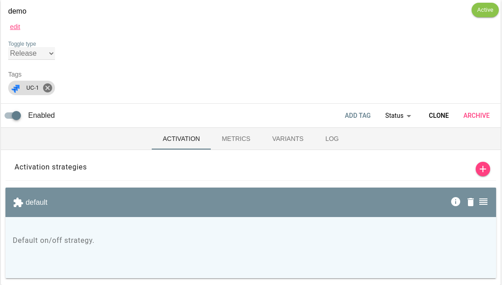

> This feature was introduced in _Unleash v3.11.0_.

Enables commenting on issues from unleash when toggles are updated/revived/archived/created.

## Configuration

#### Events

You can choose to trigger updates for the following events (we might add more event types in the future):

- feature-created
- feature-updated
- feature-archived
- feature-revived

#### Parameters

Unleash Jira Commenter addons takes the following parameters.

- **JIRA base url** - e.g. https://mycompany.atlassian.net.
- **JIRA username** - the username of the user the plugin should comment as.
- **JIRA api token** - an api token for the user the plugin should comment as.

An api token can be configured using https://id.atlassian.com/manage-profile/security/api-tokens when logged in as the users you'd like the plugin to make the comment as.

#### Tags

- The Jira commenter addon also defined the Tag Type "jira". You may use this tag to tell the plugin which issue Unleash should post updates to.
- The value of the tag should be in normal JIRA issue format (PROJECTKEY-ISSUENUMBER).

In the picture you can see we have defined one Jira tag for the `demo` toggle. In this example, the issue **UC-1** would receive updates then something happens to this toggle
