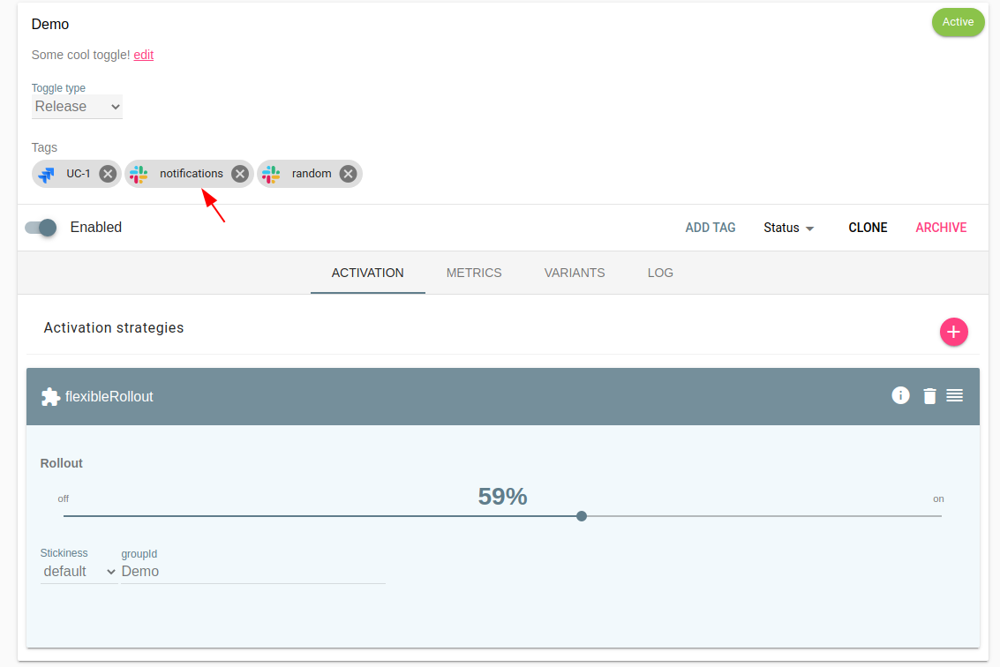

> This feature was introduced in _Unleash v3.11.0_.

The Slack addon allows Unleash to post Updates when a feature toggle is updated. To set up Slack, you need to configure an incoming Slack webhook URL. You can follow [Sending messages using Incoming Webhooks](https://api.slack.com/incoming-webhooks) on how to do that. You can also choose to [create a slack app for Unleash](https://api.slack.com/apps), which will provide you with additional functionality to control how Unleash communicates messages on your Slack workspace.

The Slack addon will perform a single retry if the HTTP POST against the Slack Webhook URL fails (either a 50x or network error). Duplicate events may happen,m and you should never assume events always comes in order.

## Configuration

#### Events

You can choose to trigger updates for the following events (we might add more event types in the future):

- feature-created
- feature-updated
- feature-archived
- feature-revived

#### Parameters

Unleash Slack addon takes the following parameters.

- **Slack Webhook URL** - This is the only required property. If you are using a Slack Application you must also make sure your application is allowed to post to the channel you want to post to.
- **Username** - Used to override the username used to post the update to a slack channel.
- **Emoji Icon** - Used to override the emoji icon used to post the update to a slack channel.
- Default channel - Where to post the message if the feature toggles has not overriden the channel via the slack tags.

#### Tags

The Slack addon also defined the Tag type "slack". You may use this tag to override which slack channel Unleash should post updates to for this feature toggle.

In the picture you can see we have defined two slack tags for the "Demo" toggle. In this example Unleash will post updates to the **#notifications** and **#random** channel.
