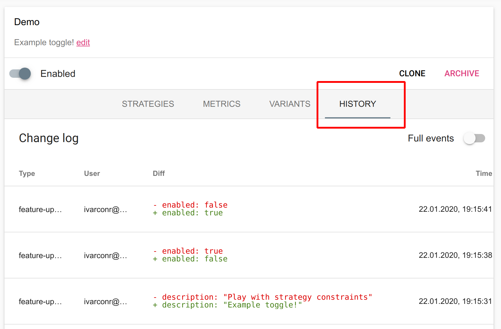
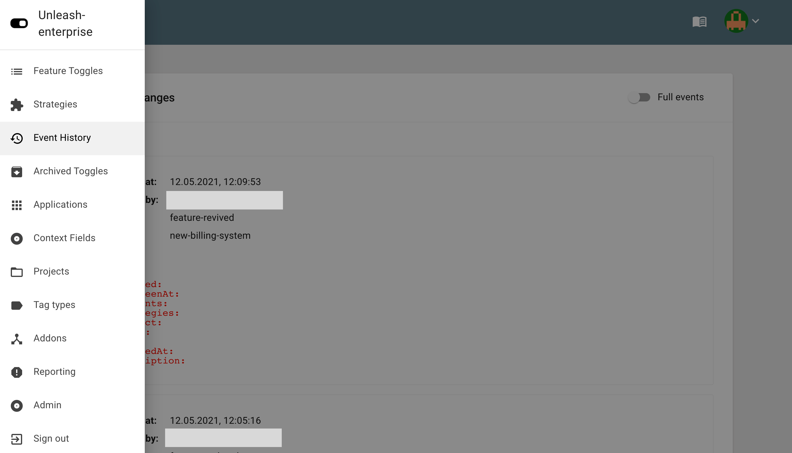

When something is not working as expected it is important to be able to track what changed when, and who performed the change.

## Audit log per feature toggle

Unleash comes with a audit log, available on a feature toggle level. You access the audit log via the “history” tab in the feature toggle view.

## Global Audit Log

Unleash also keeps an audit log across all toggles and activation strategies, tracking all changes. You access the global audit log via the “Event history”, which you can find in the drawer menu. 

