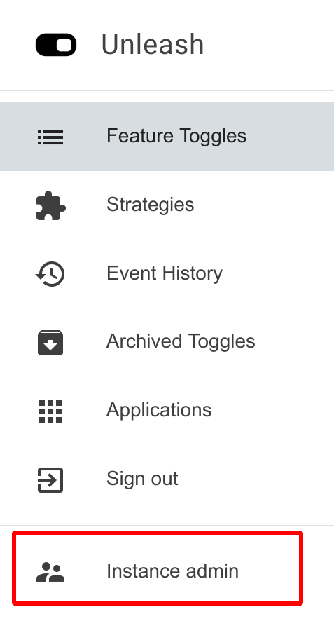

In this guide we explain how to use feature toggles in a Node application using Unleash-hosted. We will be using the open source Unleash [Node.js Client SDK](https://github.com/Unleash/unleash-client-node).

> **Important details**
>
>Make sure your have the following details available:
>
>- **API URL** – Where you should connect your client SDK
>- **API Secret** – Your API secret required to connect to your instance. 
>You can find this information in your “Instance admin”. 



## Step 1: Install client SDK

First we must install Node.js dependency:

```sh
npm install unleash-client --save
```

## Step 2: Initialize client SDK

Next we must use initialize the client SDK in the application:

```sh
const unleash = require('unleash-client');
    
unleash.initialize({
  url: 'https://YOUR-API-URL',
  appName: 'my-node-name',
  environment: process.env.APP_ENV,
  customHeaders: {'Authorization': 'SOME-SECRET'}
});
```

The example code above will initialize the client SDK, and it will connect to the Unleash-hosted demo instance. It also uses the API token for the demo instance. You should change the URL and the Authorization header (API token) with the correct values for your instance, which you may locate under “Instance admin” in the menu.

Please also pay attention to the “environment” option. Setting this will allow you to use [strategy constraints](../user_guide/strategy-constraints) which enables different roll-out strategies per environment. 

 

## Step 3: Use the feature toggle

Now that we have initialized the client SDK in our application we can start using feature toggles defined in Unleash in our application. To achieve this we have the “isEnabled” method available, which will allow us to check the value of a feature toggle. This method will return **true** or **false** based on whether the feature should be enabled or disabled for the current request. 

```sh
setInterval(() => {
    if(unleash.isEnabled('DemoToggle')) {
      console.log('Toggle enabled');
    } else {
      console.log('Toggle disabled');
    }
}, 1000);
```

Please note that in the above example we put the isEnabled-evaluation inside the setInterval method. This is required in the small example to make sure that the feature toggle is not evaluated, and application exits, before the client SDK have been able to synchronize with the Unleash-hosted API. State is kept in memory by the client SDK (and synchronizes with the Unleash-hosted API in the background). This is done to prefer performance over update speed. You can read more about the [Unleash architecture](https://www.unleash-hosted.com/articles/our-unique-architecture).

It can also be nice to notice that if you use an undefined feature toggle the Unleash SDK will return false instead of crashing your application. The SDK will also report metrics back to Unleash-hosted on feature toggle usage, which makes it [possible to spot toggles not yet defined](../user_guide/discover-unknown-toggles). And this is a very neat way to help you debug if something does not work as expected.

## Step 4: Provide the Unleash-context

It is the client SDK that computes whether a feature toggle should be considered enabled or disabled for  specific use request. This is the job of the activation strategies, which are implemented in the client SDK.

The activation strategies is an implementation of rules based on data, which you provide as part of the Unleash Context.

You provide the Unleash context as part of the second argument to the isEnabled call:

```sh
    const context = {
        userId: '123',
        sessionId: '123123-123-123,
        remoteAddress: '127.0.0.1',
    };
    const enabled = isEnabled('app.demo', context);
```
