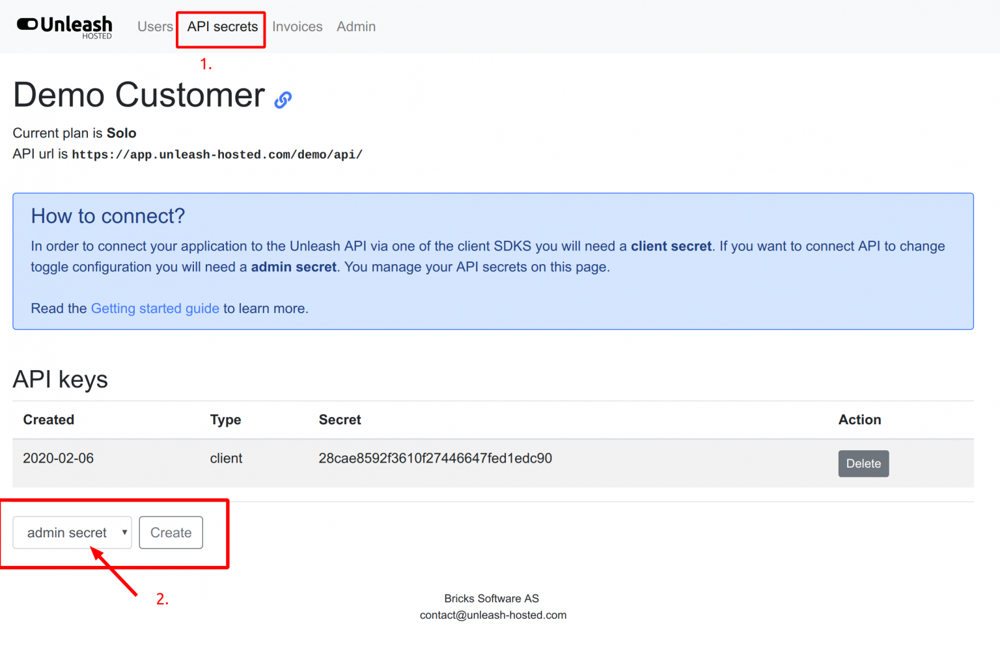
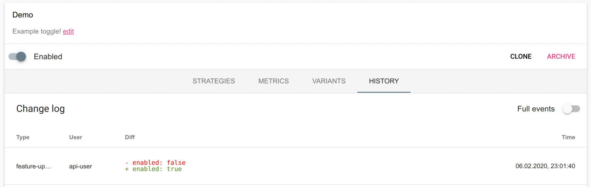

> **Enterprise feature**
>
> Programmatic access to the Unleash API s only available with the Unleash Enterprise offering and is not part of Unleash Open-Source.

It is possible to integrate directly with the Admin API. In this guide we will explain all the steps to set it up.

## Step 1: Create API token

You will need access tokens with admin privileges to be allowed to connect to the Admin Unleash-API. You can create these tokens in the “Instance Admin” as part of the “API secrets” section. 

Please note that it take up to 60 seconds for the new key to propagate to all Unleash-hosted instances. 

> If you need API token to use in a client SDK you should create a "client token" as these have less privileges.



## Step 2: Use Admin API

Now that you have an access token with admin privileges we can use that to perform changes in our Unleash-hosted instance. 

In the example below we will use the [Unleash Admin API](../api/admin/features) to enable the “Demo” feature toggle sing curl. 

```sh
curl -X POST -H "Authorization: admintokenher"
https://app.unleash-hosted.com/demo/api/admin/features/Demo/toggle/on
```

**Great success!** We have now enabled the feature toggle. We can also verify that it was actually change by the API user by navigating to the history (audit log) for this feature toggle.
  


## API overview

You find the full documentation on everything the Unleash API support on the [Unleash API documentation](../api/admin/features).
