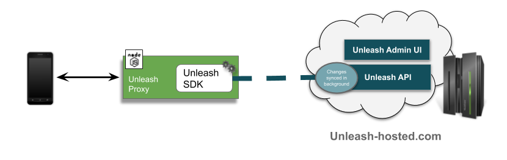

> **Enterprise feature**
>
> Working with native apps, require the unleash proxy. The Unleash Proxy is only available with the Unleash-hosted offering and is not part of Unleash Open-Source.

For a highlevel introduction to the Unleash-proxy, please read this short article [The Unleash-Proxy](https://www.unleash-hosted.com/articles/the-unleash-proxy)

The Unleash-proxy consist of the proxy that exposes a simple API for the client.



## The Proxy-client

There is a js implentation of the proxy-client available. 
Find it here: [https://github.com/unleash-hosted/unleash-proxy-client-js](https://github.com/unleash-hosted/unleash-proxy-client-js)

## The Proxy-API

When accessing the Proxy, [Unleash context fields](unleash_context) from the session context can be added as parameters to the request. The proxy will return only enabled feature toggles and their evaluated value for the given context. You may also use custom context fields in combination with [strategy constraints](strategy_constraints).

```sh
https://hostname.com/api/proxy?appName=webapp&userId=123&country=NO
```
The Proxy will return a list of all the active feature toggles, including variants, available. See an example below
```sh
{
    "toggles": [
    {
        "enabled": true,
        "name": "SimpleToggle",
        "variant": {
            "enabled": false,
            "name": "disabled"
        }
    },
    {
        "enabled": true,
        "name": "ToggleWithVariant",
        "variant": {
            "enabled": true,
            "name": "brown"
        }
    },
    {
        "enabled": true,
        "name": "ToggleWithVariantAndPayload",
        "variant": {
            "enabled": true,
            "name": "default",
            "payload": {
                "type": "string",
                "value": "Some custom value here!"
            }
        }
    }
    ]
}
```
