> **Enterprise**
>
> Project support is only available in Unleash Enterprise

## Overview
This topic explains how projects are supported in Unleash, how to create and maintain them.

## Understanding purpose of projects
Projects are a way to organize your feature toggles within Unleash. Within a large organization, having multiple feature toggles, staying on top of the feature toggles might become a challenge. Every feature toggle will be part of a project. Examples of projects can be linked to a development team or to functional modules within the software. 

A common pattern is to organize the feature toggles according to key areas of the application, e.g. “Basic user process” and “Advanced user process”. This is illustrated below.

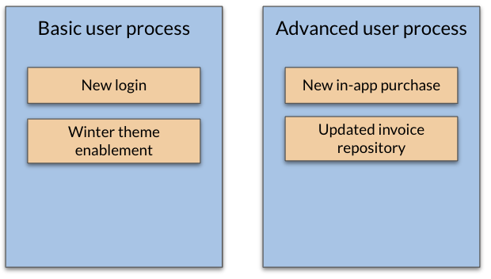

## Creating a new project
When you log into Unleash for the first time, there is a Default project already created. All feature toggles are included in the Default project, unless decided otherwise.

From the top-line menu – click on the hamburger icon.

From the menu – choose “Projects”

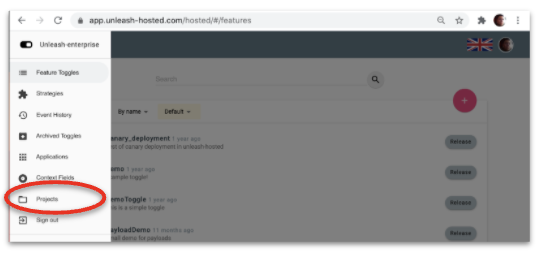

The available projects will now be listed.
To create a new Project – choose the “+”

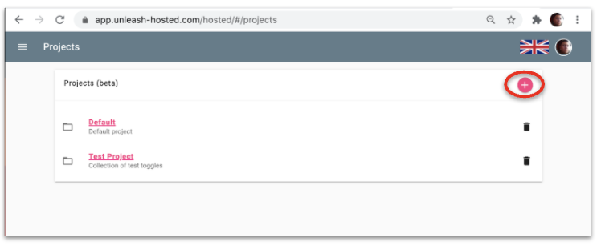

The configuration of a new Project is now available. the following input is available to create the new Project.

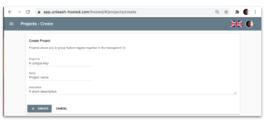

| Item     | Description |
| ----------- | ----------- |
| Project Id     | Id for this Project      |
| Project name   | The name of the Project.       |
| Description   | A short description of the project       |

## Deleting an existing project
To keep your feature toggle clean, removing deprecated projects is important. From the overview of Projects – choose the Delete button for the project you want to delete.

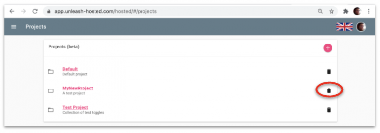

## Filter feature toggles on projects
When browsing the feature toggles in Unleash, you might want to filter the view by looking only at the ones included in the project of interest. This is possible from the Feature toggle overview.

From the top-line menu – choose the hamburger icon

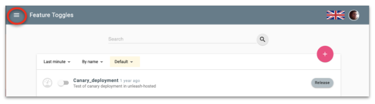

From the menu – choose “Feature toggles”

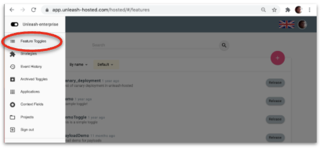

The list of features toggles can be filtered on the project of your choice. By default, all feature toggles are listed in the view.

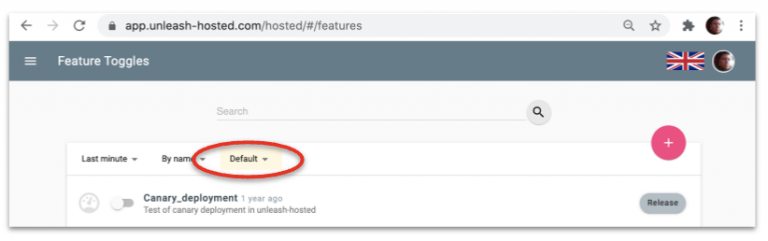

From the drop-down, chose the project to filter on.

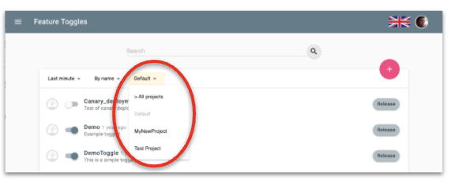

The view will now be updated with the filtered feature toggles.

## Assigning project to a new feature toggle
When creating a new feature toggle, the project where the feature toggle will be created may be chosen. The default project is “Default”

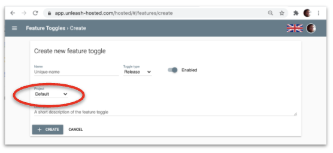

All available projects are available from the drop-down menu. 

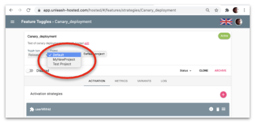

## Change project for an existing feature toggle
There might be a need to change the project a feature toggle belongs to. Changing the project is possible from the feature toggle configuration page.

To change the project, simply change the project from the drop-down menu.
