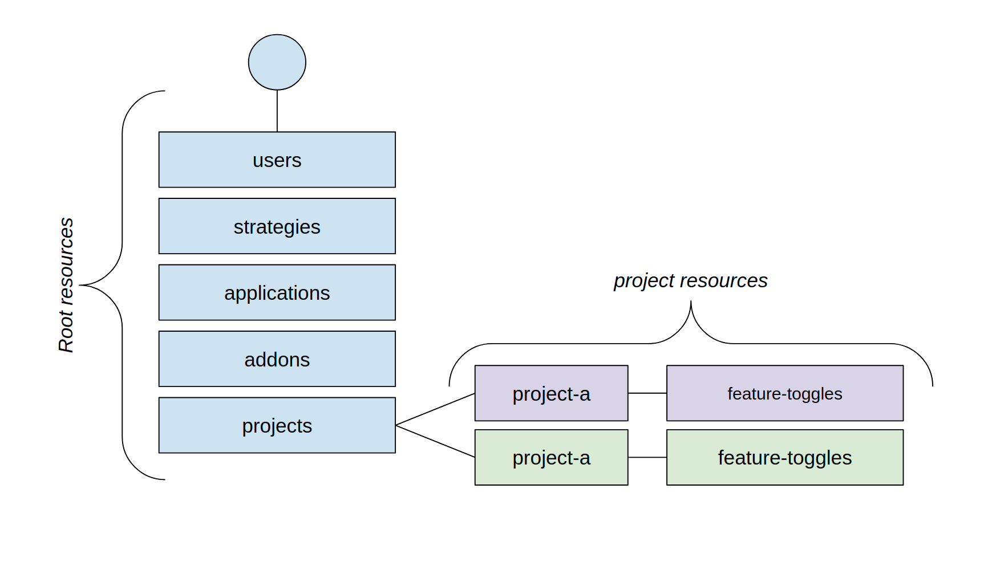

This document forms the specifications for [Role-Based Access Control](https://en.wikipedia.org/wiki/Role-based_access_control) which was introduced as part of the **Unleash v4 release**.

### Core principles

Unleash has two levels in it’s hierarchy of resources:

1. **Root resources** - Everything that lives across the entire Unleash instance. Examples of this includes:
   - activation strategies
   - context field definitions
   - addon configurations
   - applications
   - users
2. **Project resources** - Resources which are only available under a project. Today this is only “feature toggles” (but we expect more resources to live under a project in the future). A feature toggle will belong to only one single project. In Unleash-Open source there exists only a single project, the “default” project, while Unleash Enterprise supports multiple projects.

Unleash v4 allows you control access to both "root resources" and individual project resources.

### Root Roles

> Available for Unleash Open-Source and Unleash Enterprise.

Unleash will come with three "root" role out of the box:

- **Admin** - Used to administer the Unleash instance. Is allowed to add/remove users, add them to roles and update role permissions.
- **Editor** - Represent users with typical read and write access to Unleash. They will typically be allowed to create new projects (for enterprise), create feature toggles on the "default" project, configure context fields etc. They will not be able to add/remove users or roles.
- **Viewer** - Users with this role are only allowed to read resources in Unleash. They might be added as collaborators to specific projects.

### Project

> Project roles are part of Unleash Enterprise.

Per project two roles are now available:

- **Owner** - Allowed to update the project. This includes adding and removing project members and their role.
- **Member** - Allowed to create and update feature toggles within the project. They can not update the project itself

It is important to highlight that we have not introduced a Viewer role on the project level. We believe that all users in Unleash should be able to to View all feature toggles and configuration within an organization. (If we learn this not to be the case we can add a separate role for READ access later).

### Custom Roles

> Will only be introduced for Unleash Enterprise.

In a later iteration we will introduce the concept of "custom roles". This will allow full customization to meet internal needs of larger organisations. We believe these should be able to define access across both “root resources” and specific projects resources. We need further investigation with customers before we land custom roles.

Please let us know if you have feedback or ideas on how custom roles should work in order to solve your company needs.
