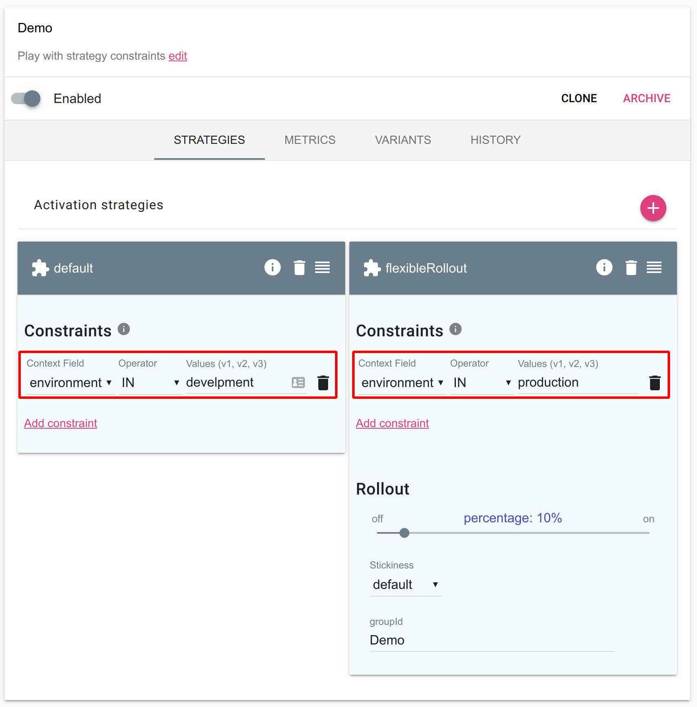
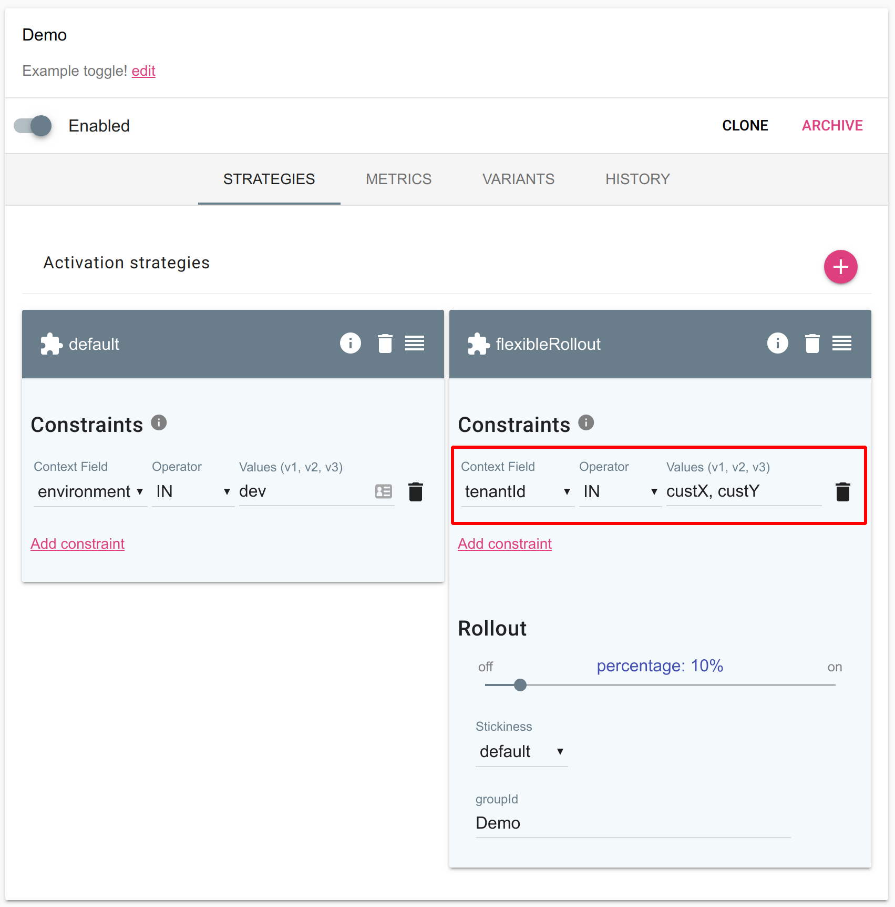
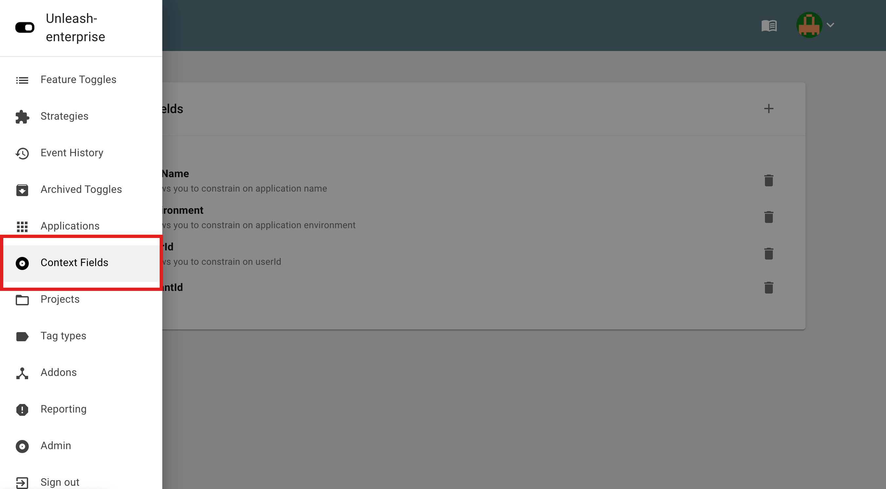
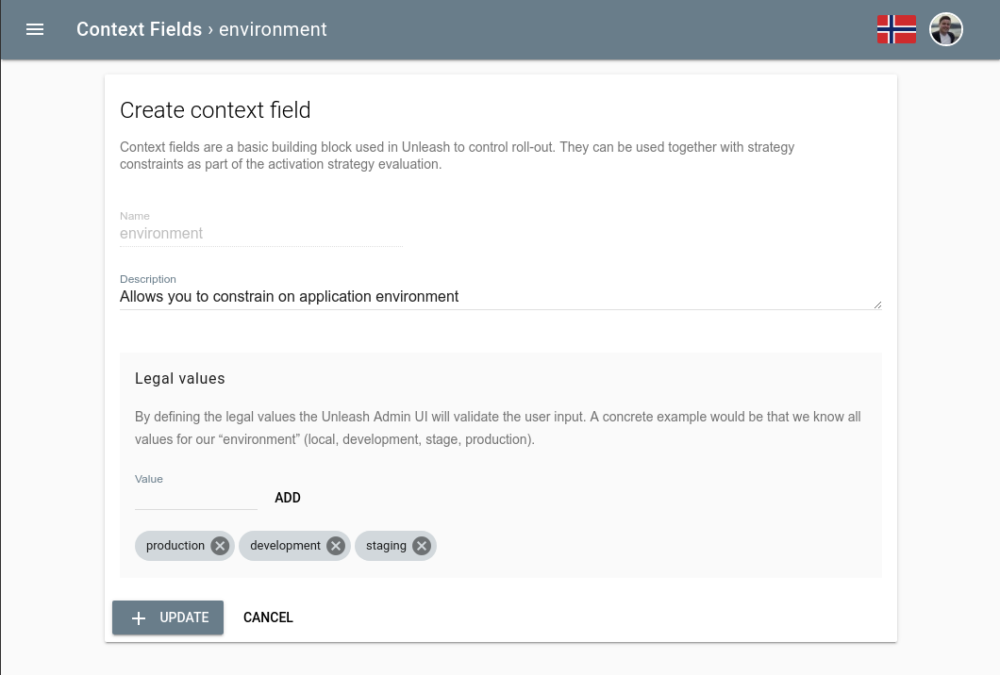

> **Enterprise feature**
>
> Strategy constraints is only available with the Unleash-hosted offering and is not part of Unleash Open-Source.

Strategy constraints allow you to set pre-conditions on activation strategies that needs to be satisfied for the activation strategies to take effect. 

## Constrain on a specific environment

The most common use case for strategy constraints is that you want an activation strategy to only take effect in a specific environment.  For example you could enable the feature for everyone in development, while you only expose the new feature to a few percentage of the users in production. 

## Constrain on custom context fields

It is also possible to constrain a activation strategy configuration on custom context fields. A common use case is a multi-tenant service where you want to control roll-out on a tenant identifier. This enable you to decide which customer should get access to your new feature. 

## Define your own custom fields

> Starting with Unleash-enterprise version 3.2.28 customers can define their custom context fields via the user interface.

You can also define your own custom context fields that you can use together with strategy constraints. We have seen customer use multiple variants of custom context fields to control their feature roll-out:

- region
- country
- customerType
- tenantId

Combining strategy constraints with the “flexibleRollout” allows you to do gradual roll-out to a specific segment of your user base.

### Step 1: Navigate to “Context Fields“
Locate “context fields in the menu

### Step 2: Define new context field

Next you can define your new context field. The minimum requirement is to give it a unique *name*. In addition you can give it a description and define the legal values.

#### What is “legal values”?

Legal values defines all possible values for the context field. this will be used in Unleash Admin UI to guide users when working with context fields to make sure they only use legal values.

