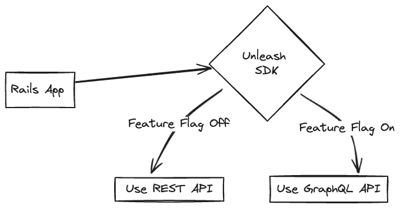
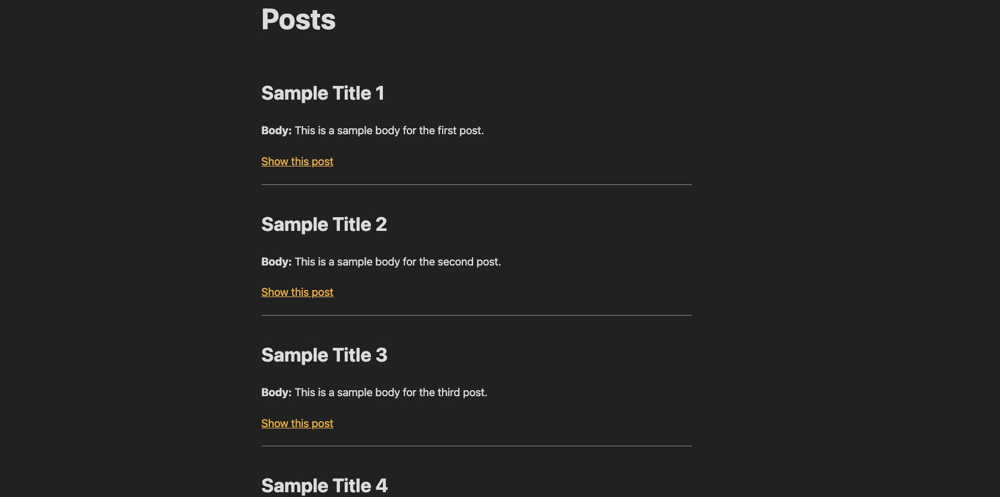

Hello! In this tutorial, we’ll show you how to add feature flags to your Django app, using [Unleash](https://www.getunleash.io/) and the official [Unleash Python SDK](https://docs.getunleash.io/reference/sdks/python). With Unleash, an open-source feature flag service, you can use our tooling to add feature flags to your application and release new features faster.

In a classic tutorial fashion, we’ll add feature flags to a blog app made with Django. We’ll use feature flags to decide how many blog posts to show on the index page.

-   [Prerequisites](#prerequisites)
-   [1. Best practices for back-end apps with Unleash](#1-best-practices-for-back-end-apps-with-unleash)
-   [2. Install a local feature flag provider](#2-install-a-local-feature-flag-provider)
-   [3. Set up the Django app](#3-set-up-the-django-app)
    -   [Set up and seed the database](#set-up-and-seed-the-database)
    -   [Run the server](#run-the-server)
-   [4. Restrict the number of posts](#4-restrict-the-number-of-posts)
-   [5. Add Unleash to your Django app](#5-add-unleash-to-your-django-app)
-   [6. Verify the toggle experience](#6-verify-the-toggle-experience)
-   [Conclusion](#conclusion)

## Prerequisites

For this tutorial, you'll need the following:

-   Python3.10+
-   Git
-   Docker and Docker Compose



The Unleash Server is a **Feature Flag Control Service**, which manages your feature flags and lets you retrieve flag data. Unleash has a UI for creating and managing projects and feature flags. There are also [API commands available](https://docs.getunleash.io/reference/api/unleash) to perform the same actions straight from your CLI or server-side app.

## 1. Best practices for back-end apps with Unleash

Django is a back-end framework, so there are special considerations to plan around when implementing feature flags.

Most importantly, you must:

-   Limit feature flag payloads for scalability, security, and efficiency
-   Use graceful degradation where possible to improve the resiliency of your architecture

For a complete list of architectural guidelines, including caching strategies, see our [best practices for building and scaling feature flag systems](https://docs.getunleash.io/topics/feature-flags/feature-flag-best-practices).

## 2. Install a local feature flag provider

In this section, we'll install Unleash, run the instance locally, log in, and create a feature flag. If you prefer, you can use other tools instead of Unleash, but you'll need to update the code accordingly. The basic steps will probably be the same.

Use Git to clone the Unleash repository and Docker to build and run it. Open a terminal window and run the following commands:

```
git clone https://github.com/unleash/unleash.git
cd unleash
docker compose up -d
```

You will now have Unleash installed onto your machine and running in the background. You can access this instance in your web browser at [http://localhost:4242](http://localhost:4242).

Log in to the platform using these credentials:

```
Username: admin
Password: unleash4all
```

Click the 'New feature flag' button to create a new feature flag.


Call it `top-3` and enable it in the `development` environment.


Everything's now set up on the Unleash side. Let's set up the Django application.

## 3. Set up the Django app

Let's clone a basic blog repository and get it up and running. We don't want to waste time setting up a Django codebase from scratch.

```sh
git clone https://github.com/alvinometric/django-basic-blog
cd django-basic-blog
```

#### Set up and seed the database

This repository uses SQLite, so no additional dependencies or migrations are required.

```sh
python manage.py loaddata initial_data.json
```

#### Run the server

```sh
python manage.py runserver
```

Go to [http://localhost:8000](http://localhost:8000) and check that you see the following:



## 4. Restrict the number of posts

Right now all the blog posts are displayed on the index page. We want to use a feature flag to change that and restrict it to the 3 most recent posts.

Let's create a static boolean flag, for now.

Modify the `post_list` view in `blog/views.py` to look like this:

```python
from django.shortcuts import render
from .models import Post

def post_list(request):
    is_top3 = True
    posts = Post.objects.order_by('-created_at')[:3] if is_top3 else Post.objects.all()
    return render(request, 'blog/post_list.html', {'posts': posts})
```

We're using the flag in the views rather than the template, but you could also do it there. I prefer keeping my template logic as simple as possible.

Reload your browser and you should see only the 3 most recent posts.

## 5. Add Unleash to your Django app

Now, let's connect our project to Unleash so that you can toggle the feature flag at runtime. If you wanted to, you could also do a gradual rollout, and use it for A/B testing or more advanced functionality.

You'll need 2 things:

-   The URL of your Unleash instance's API. It's `http://localhost:4242/api/` for your local version. You'll want to replace it with your remote instance.
-   The API token we created on our Unleash instance.

First, install the `UnleashClient` package:

```sh
pip install UnleashClient
```

Then, create `blog/unleash_client.py`, and add the following:

```python
from UnleashClient import UnleashClient

unleash_client = UnleashClient(
    url="http://localhost:4242/api/",
    app_name="django-blog",
    custom_headers={'Authorization': '<YOUR_API_TOKEN>'}
)
unleash_client.initialize_client()
```

Then, in `blog/views.py`, update the `post_list` view:

```python
from django.shortcuts import render
from .models import Post
from .unleash_client import unleash_client

def post_list(request):
    is_top3 = unleash_client.is_enabled("top-3")
    all_posts = Post.objects.all().order_by('-published_date')
    posts = all_posts[:3] if is_top3 else all_posts
    return render(request, 'blog/post_list.html', {'posts': posts})
```

## 6. Verify the toggle experience

Reload your browser and check that you see three blog posts displayed. Turn off the flag in your Unleash instance and reload the page. You should see all the blog posts again.

See additional use cases in our [Python SDK documentation](https://docs.getunleash.io/reference/sdks/python).

> **Note:** An update to a feature flag may take 30 seconds to propagate.

## Conclusion

All done! Now you know how to add feature flags with Unleash in Django. You've learned how to:

-   Install Unleash
-   Create and enable a feature flag
-   Grab the value of a feature flag with the Python SDK, and use it in a Django app

Thank you for following this tutorial!
