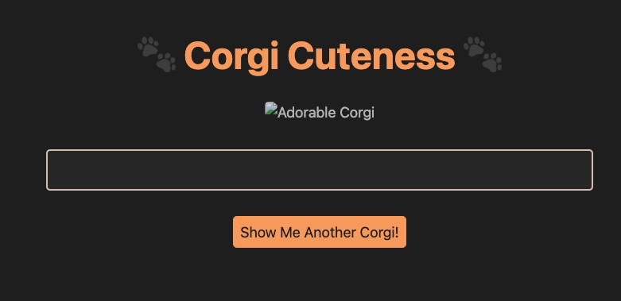
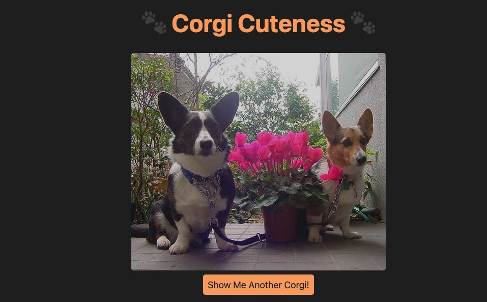

import VideoContent from '@site/src/components/VideoContent.jsx';

In this tutorial we'll show you how to add feature flags to a plain JavaScript app, using [Unleash](https://www.getunleash.io/) and the official [Unleash Browser SDK](/reference/sdks/javascript-browser). With Unleash, an open-source feature flag service, you can add feature flags to your application and release new features faster.

In this tutorial, we'll make a basic website Corgis! We'll use the [dog.ceo API 🐶](https://dog.ceo/) with HTML, CSS, JS to retrieve some images of Queen Elizabeth's favorite dogs. We'll use feature flags to decide whether to show some Corgi fun facts alongside the images.

## Prerequisites

For this tutorial, you'll need the following:
-   Git
-   Docker and Docker Compose
-   A browser or IDE; you can also use [CodeSandbox](https://codesandbox.io/docs/learn)


The Unleash Server is a **Feature Flag Control Service**, which manages your feature flags and lets you retrieve flag data. Unleash has a UI for creating and managing projects and feature flags. In this example, we'll set up our script to make a request to Unleash using the Unleash SDK and show/hide a DOM element based on the flag data we receive. 

## Install Unleash

In this section, we'll install Unleash, run the instance locally, log in, and create a feature flag.

First, use Git to clone the Unleash repository and Docker to build and run it. Open a terminal window and run the following commands:

```
git clone https://github.com/unleash/unleash.git
cd unleash
docker compose up -d
```

You now have Unleash installed on your machine and running in the background. You can access this instance in your web browser at [http://localhost:4242](http://localhost:4242).

Log in to the Unleash Admin UI using the following credentials:

```
Username: admin
Password: unleash4all
```

Click **New feature flag** to create a new feature flag.


Call it `show-info` and enable it in the `development` environment.

Everything's now set up in Unleash. Let's look at the HTML and JavaScript code next.

## Make a basic HTML website

Open a new tab in your terminal, and create a new folder outside of the Unleash folder.

```sh
mkdir unleash-js
cd unleash-js
touch index.html
```

In the `index.html` file, add the following:

```html
<!DOCTYPE html>
<html lang="en">
    <head>
        <meta charset="UTF-8" />
        <meta name="viewport" content="width=device-width, initial-scale=1.0" />
        <title>Corgi Cuteness</title>
        <link
            rel="stylesheet"
            href="https://cdn.simplecss.org/simple.min.css"
        />
        <style>
            :root {
                --accent: #f4a261;
                --border: #d9c3b8;
            }

            h1 {
                color: var(--accent);
            }

            main {
                padding: 1rem;
                text-align: center;
            }
        </style>
    </head>
    <body>
        <main>
            <h1>🐾 Corgi Cuteness 🐾</h1>
            
            <p id="fun-fact" class="notice"></p>
            <button id="new-corgi-btn">Show Me Another Corgi!</button>
        </main>

        <script src="./index.js"></script>
    </body>
</html>
```

Open the file in your browser, you'll see something like this:



## Fetch images from the API

Let's add a bit of JavaScript to fetch a photo of a Corgi from the [dog.ceo API](https://dog.ceo/) and insert a random fun fact in the notice box. We'll add an event listener to the button so we can fetch a new image on click. In this file, we'll also import the Unleash Client.

Create a file called `index.js`:

```js
import { UnleashClient } from "https://esm.sh/unleash-proxy-client";

const corgiImg = document.getElementById("corgi-img");
const funFact = document.getElementById("fun-fact");
const newCorgiBtn = document.getElementById("new-corgi-btn");
const unleash = null;

const funFacts = [
    "Corgis were originally bred for herding cattle and sheep.",
    "The name 'Corgi' means 'Dwarf Dog' in Welsh.",
    "Corgis are the favorite dog breed of Queen Elizabeth II.",
    "Corgis have a 'fairy saddle' marking on their back.",
    "There are two types of Corgis: Pembroke and Cardigan.",
    "Corgis are excellent swimmers despite their short legs.",
    "A group of Corgis is called a 'corggle'.",
];

async function start() {
    await fetchCorgi();
}

async function fetchCorgi() {
    corgiImg.alt = "Loading...";
    funFact.textContent = "Fetching a cute Corgi...";

    const response = await fetch(
        "https://dog.ceo/api/breed/corgi/images/random"
    );
    const data = await response.json();
    corgiImg.src = data.message;

    funFact.textContent = funFacts[Math.floor(Math.random() * funFacts.length)];
}

newCorgiBtn.addEventListener("click", fetchCorgi);

start();
```

Refresh your browser again. Our website is now functional.



## 5. Add Unleash to your website

Now, let's connect our project to Unleash so that you can toggle a feature flag at runtime. If you wanted to, you could also do a [gradual rollout](/feature-flag-tutorials/use-cases/gradual-rollout) or use the flag for [A/B testing](/feature-flag-tutorials/use-cases/a-b-testing).

You'll need two things:

-   The URL of your Unleash instance's API. It's `http://localhost:4242/api/` for your local version.
-   A [client API token](./reference/api-tokens-and-client-keys#client-tokens). You can create one inside a project in **Settings > API access**.

You can now initialize your Unleash client as follows:

```js
const unleash = new UnleashClient({
    url: "http://localhost:4242/api/",
    clientKey: "YOUR_API_KEY",
    appName: "corgi-site",
});
```

Now, let's add our client to the project, after the selectors. Don't forget to also update the config with your API key, and start the Unleash server.

```js
const corgiImg = document.getElementById("corgi-img");
const funFact = document.getElementById("fun-fact");
const newCorgiBtn = document.getElementById("new-corgi-btn");
const unleash = new UnleashClient({
    url: "http://localhost:4242/api/",
    clientKey: "YOUR_API_KEY",
    appName: "corgi-site",
});

unleash.start();
```

Then, we can decide to show the info box component only if the `show-info` flag is enabled. Let's update our `fetchCorgi` function so it looks like the following:

```diff
async function fetchCorgi() {
  corgiImg.alt = "Loading...";
  funFact.textContent = "Fetching a cute Corgi...";

+ const showInfo = unleash.isEnabled("show-info");
+ funFact.style.display = showInfo ? "block" : "none";

  const response = await fetch("https://dog.ceo/api/breed/corgi/images/random");
  const data = await response.json();
  corgiImg.src = data.message;

  funFact.textContent = funFacts[Math.floor(Math.random() * funFacts.length)];
}
```

## 6. Verify the toggle experience

We've now connected our project to Unleash and grabbed our feature flag using JavaScript. Let's go back to the Unleash Admin UI and turn the feature flag off. We can now verify that if we disable the flag in the development environment, we no longer see the info box component with the fun facts.

> **Note:** An update to a feature flag may take 30 seconds to propagate.

## Conclusion

All done! Now you know how to add feature flags with Unleash in plain JavaScript, without any frameworks or libraries. You've learned how to:

-   Set up Unleash
-   Create and enable a feature flag
-   Grab the value of a feature flag with just JavaScript
-   Toggle between a DOM element based on a feature flag
