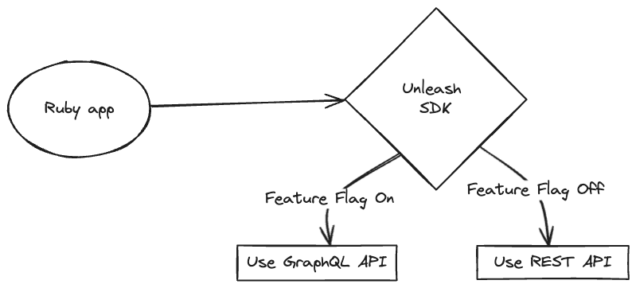
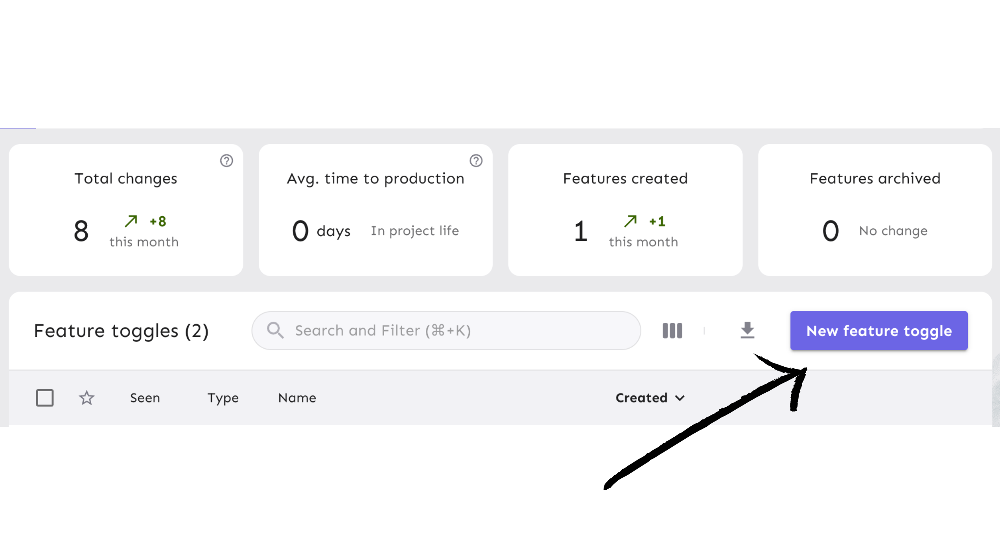

import VideoContent from '@site/src/components/VideoContent.jsx';

Hello! In this tutorial we’ll show you how to add feature flags to your Ruby app , using [Unleash](https://www.getunleash.io/) and the official [Unleash Ruby SDK](/reference/sdks/ruby). With Unleash, an open-source feature flag service, you can use our tooling to add feature flags to your application and release new features faster.

In a classic tutorial fashion, we’ll get a list of planets from the [Star Wars API](https://swapi.py4e.com), with just Ruby (i.e., not Ruby on Rails). We’ll use feature flags to decide whether to call the REST or the GraphQL version of the API.

-   [Prerequisites](#prerequisites)
-   [1. Best practices for back-end apps with Unleash](#1-best-practices-for-back-end-apps-with-unleash)
-   [2. Install a local feature flag provider](#2-install-a-local-feature-flag-provider)
-   [3. Grab a list of planets from the Star Wars API](#3-grab-a-list-of-planets-from-the-star-wars-api)
-   [4. Add the GraphQL endpoint](#4-add-the-graphql-endpoint)
-   [5. Add Unleash to your Ruby app](#5-add-unleash-to-your-ruby-app)
-   [6. Verify the toggle experience](#6-verify-the-toggle-experience)
-   [Conclusion](#conclusion)

Watch the video tutorial and follow along with the code from this documentation.


<VideoContent videoUrls={["https://www.youtube.com/embed/lgR9jUek94U?si=nEX9vnAehlSMpkzw"]}/>

## Prerequisites

For this tutorial, you’ll need the following:

-   Ruby v3+
-   Git
-   Docker and Docker Compose
-   (Optional) Bundler, to manage your gemfile



The Unleash Server is a **Feature Flag Control Service**, which manages your feature flags and lets you retrieve flag data. Unleash has a UI for creating and managing projects and feature flags. There are also [API commands available](/api-overview) to perform the same actions straight from your CLI or server-side app.

## 1. Best practices for back-end apps with Unleash

Ruby is a back-end language, so there are special considerations to plan around when implementing feature flags.

Most importantly, you must:

-   Limit feature flag payloads for scalability, security, and efficiency
-   Use graceful degradation where possible to improve the resiliency of your architecture.

For a complete list of architectural guidelines, including caching strategies, see our [best practices for building and scaling feature flag systems](/guides/feature-flag-best-practices).

## 2. Install a local feature flag provider

In this section, we’ll install Unleash, run the instance locally, log in, and create a feature flag. If you prefer, you can use other tools instead of Unleash, but you’ll need to update the code accordingly. The basic steps will probably be the same.

Use Git to clone the Unleash repository and Docker to build and run it. Open a terminal window and run the following commands:

```
git clone https://github.com/unleash/unleash.git
cd unleash
docker compose up -d

```

You will now have Unleash installed onto your machine and running in the background. You can access this instance in your web browser at [http://localhost:4242](http://localhost:4242).

Log in to the platform using these credentials:

```
Username: admin
Password: unleash4all
```

Click the ‘New feature flag’ button to create a new feature flag.



Call it `graphql-api` and enable it in the `development` environment.


Everything’s now setup on the Unleash side. Let’s go to the code now.

## 3. Grab a list of planets from the Star Wars API

We’ll use `httpx` to make our http requests and the Unleash SDK to connect to your local Unleash instance and retrieve your feature flag.

Open a new tab in your terminal, and create a new folder (NOT in the unleash folder).

```sh
mkdir unleash-ruby
```

Then, create a file named `main.rb`.

Install dependencies

```sh
gem install httpx unleash
```

Then, let’s make sure our setup is working. Let’s make a call to the REST API to retrieve a list of planets and their population numbers.

```ruby

require 'httpx'
require 'json'
require 'unleash'

# Call the REST API
response = HTTPX.get('https://swapi.py4e.com/api/planets/')
planets = JSON.parse(response.body)['results'].map do |planet|
  { name: planet['name'], population: planet['population'] }
end

puts "There are #{planets.length} planets"
```

Run the code:

```ruby
ruby main.rb
```

You should see `There are 10 planets` in your terminal.

## 4. Add the GraphQL endpoint

The point of this tutorial is to mimic a real-world scenario where, based on a boolean feature flag, you would migrate from a REST API to GraphQL. So far, we’ve just used REST. Now, let’s add the GraphQL version. The GraphQL endpoint is `https://swapi-graphql.netlify.app/.netlify/functions/index`, which looks like someone’s weekend project but is an official endpoint [from Apollo](http://graphql.org/swapi-graphql).

Let’s create a static feature flag, for now, just to test that we can call both versions successfully.

```ruby
require 'httpx'
require 'json'
require 'unleash'

# Define a static feature flag
is_graphql = true
if is_graphql
  # Call the GraphQL API
  query = {
    query: '
      {
        allPlanets {
          planets {
            population
            name
          }
        }
      }
    '
  }

  response = HTTPX.post('https://swapi-graphql.netlify.app/.netlify/functions/index', body: query.to_json,
    headers: { 'Content-Type' => 'application/json' })
  planets = JSON.parse(response.body)['data']['allPlanets']['planets']
  puts "Hello GraphQL"
else
  # Call the REST API
  response = HTTPX.get('https://swapi.py4e.com/api/planets/')
  planets = JSON.parse(response.body)['results'].map do |planet|
    { name: planet['name'], population: planet['population'] }
  end
end

puts "There are #{planets.length} planets"

```

Run the code again:

```ruby
ruby main.rb
```

You should see `Hello GraphQL`, followed by `There are 60 planets` in your terminal.

Yes, there are more planets with the GraphQL API, this is because the REST API is paginated.

## 5. Add Unleash to your Ruby app

Now, let’s connect our project to Unleash so that you can toggle that feature flag at runtime. If you wanted to, you could also do a gradual rollout, use it for a/b testing, etc.

You’ll need 2 things:

-   The URL of your Unleash instance’s API. It’s `http://localhost:4242/api/` for your local version. You’ll want to replace it with your remote instance.
-   The API token we created on our Unleash instance, feel free to create another one if you can’t find it.

With these 2, you can initialize your Unleash client as follows:

```ruby
@unleash = Unleash::Client.new(app_name: 'starwars_ruby', url: 'http://localhost:4242/api/', custom_http_headers: {
  'Authorization': 'YOUR_API_KEY'
})
```

You can check our [API token and client keys documentation](/reference/api-tokens-and-client-keys) for more specifics.

Now, let’s add our client to our project, grab the feature flag from Unleash, and update our conditional statement. Don't forget to also update the config with your API key.

```diff
require 'httpx'
require 'json'
require 'unleash'

+ @unleash = Unleash::Client.new(app_name: 'starwars_ruby', url: 'http://localhost:4242/api/', custom_http_headers: {
+  'Authorization': 'YOUR_API_KEY'
+ })

+ if @unleash.is_enabled?("graphql")
- # Define a static feature flag
- is_graphql = true
- if is_graphql
  # Call the GraphQL API

  # ... rest of the code

```

See additional use cases in our [Backend SDK with Ruby](/reference/sdks/ruby) documentation.

## 6. Verify the toggle experience

Now that we’ve connected our project to Unleash and grabbed our feature flag, we can verify that if you disable that flag in your development environment, you stop seeing the `Hello GraphQL` message and only get 10 planets.

> **Note:** An update to a feature flag may take 30 seconds to propagate.


## Conclusion

All done! Now you know how to add feature flags with Unleash in Ruby. You’ve learned how to:

-   Toggle between a REST and a GraphQL endpoint based on a feature flag
-   Install Unleash and create/enable a feature flag
-   Grab the value of a feature flag with the Ruby SDK

Thank you
