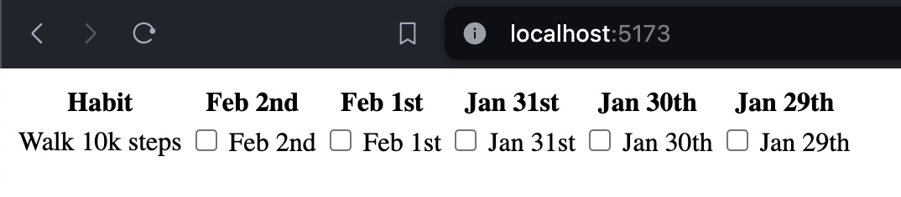
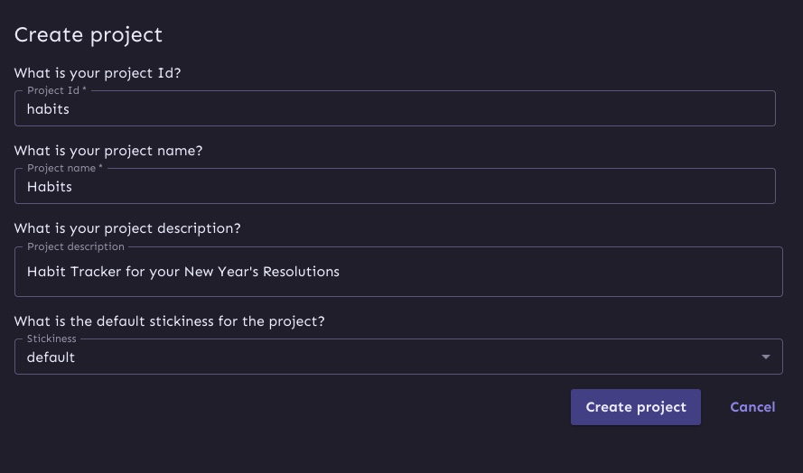
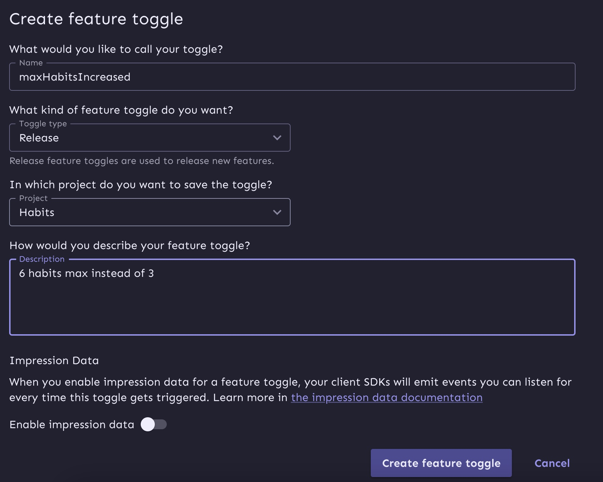

Hello and welcome to another article. This is about adding feature flags to an app made with [SvelteKit](https://kit.svelte.dev/) and [Unleash](https://www.getunleash.io/). We'll make a paired-down habits app to keep track of your new year's resolutions.

This is not meant to be a complete product, but enough to show you the different approaches to working with feature flags in a "fullstack" framework. The final code is available in [this repo](https://github.com/alvinometric/unleash-sveltekit).

## Setup

Create a skeleton Sveltekit project named "habits".

```
npm create svelte@latest habits
```

We'll need a few more dependencies, let's install them now so it's out of the way.

```
npm i date-fns @unleash/proxy-client-svelte unleash-client
```

## Let's make a basic habits app

We'll use Svelte stores to keep track of a global array of habits. For the sake of simplicity, we won't store these habits anywhere yet (feel free to add localStorage or a database). Our basic habit app will only consist of 3 files.

First, a global store that will contain our habits and their completion dates.

```js
// src/lib/stores.js
import { writable } from "svelte/store";

export const habitStore = writable([
  {
    id: 1,
    name: "Walk 10k steps",
    completedDays: [],
  },
]);
```

Then, we'll create an `App.svelte` file for our main logic.

```svelte
<script>
  // src/lib/App.svelte
  import { format, addDays } from 'date-fns';
  import Habit from '$lib/Habit.svelte';
  import { habitStore } from '$lib/stores.js';
  import AddHabit from '../lib/AddHabit.svelte';
  let maxHabits = 2;

  // go back 5 days
  const dates = new Array(5).fill(0).map((_, i) => {
    let today = new Date();
    return addDays(today, -i);
  });
</script>

<AddHabit {maxHabits} />

<table>
  <thead>
    <tr>
      <th>Habit</th>
      {#each dates as date}
        <th>{format(date, 'MMM do')}</th>
      {/each}
    </tr>
  </thead>

  <tbody>
    {#each $habitStore as habit}
      <Habit {habit} {dates} />
    {/each}
  </tbody>
</table>

```

Then, update the `+page.svelte` file (our index route) to include our app.

```svelte
<script>
  // src/routes/+page.svelte
  import App from '../lib/App.svelte';
</script>

<App />
```

And we finish the basic app with a component for each habit that be checked on and off.

```svelte
<script>
  // src/lib/Habit.svelte
  import { habitStore } from '$lib/stores.js';
  import { format } from 'date-fns';

  export let habit;
  export let dates;

  function toggleDay(day) {
    let updatedDays = [...habit.completedDays];

    const index = updatedDays.indexOf(day);
    if (index !== -1) {
      updatedDays.splice(index, 1);
    } else {
      updatedDays.push(day);
    }

    habitStore.update((items) => {
      return items.map((item) => {
        if (item.id === habit.id) {
          return { ...item, completedDays: updatedDays };
        }
        return item;
      });
    });
  }
</script>

<tr>
  <td>{habit.name}</td>

  {#each dates as date}
    <td>
      <input
        type="checkbox"
        on:click={() => toggleDay(date)}
        checked={habit.completedDays.includes(date)}
      />
      {format(date, 'MMM do')}
    </td>
  {/each}
</tr>
```

And now here's our full app in all its glory, basically a table with checkboxes.



## Adding habits and premium features

Now this is not a very user-friendly app. Let's add a few things:

- Add the ability for users create their own habits
- Limit the number of habits a user can create to a certain amount so we can turn this into a commercial product.

Let's do all of this in another component named `AddHabit.svelte`.

```svelte
<script>
  // src/lib/AddHabit.svelte
  import { habitStore } from '$lib/stores.js';

  export let maxHabits = 3;

  let habitsFull = false;

  function addHabit(e) {
    let numHabits = $habitStore.length;

    if (numHabits === maxHabits) {
      habitsFull = true;
    } else {
      let form = e.target;
      const formData = new FormData(e.target);

      habitStore.update((items) => {
        items.push({ id: items.length + 1, name: formData.get('name'), completedDays: [] });
        return items;
      });

      // reset the form
      form.reset();
    }
  }
</script>

<dialog open={habitsFull}>
  <h2>❌ Maximum Habits Reached</h2>
  <p>You can only have up to {maxHabits} on the free tier. Purchase a premium version to unlock more.</p>
  <form method="dialog">
    <button>OK</button>
  </form>
</dialog>

<form on:submit|preventDefault={addHabit}>
  <input type="text" name="name" />
  <button type="submit"> Add new habit </button>
</form>
```

What's happening here? A few things:

- An input and a button to add new habits to the store, until an arbitrary limit is reached
- A `maxHabits` prop is used to determine that limit
- When this maximum limit is reached, a modal dialog opens
- We reset the form after submission to clear the input

<video
  width="600px"
  preload="metadata"
  autoplay
  loop
  title="A maximum number of habits on the free tier"
  src="/media/habits.mp4"
  controls> </video>

## Showing a different component based on the feature flag

On to the main topic, adding feature flags.

Go to your Unleash dashboard, and create new project (you're welcome to use the default project here).


Then create a feature flag called `maxHabitsIncreased`



Bbased on whether this flag is enabled or not, we'll set the `maxHabits` value to either 6 or 2.

### Basic toggle

We'll use the official [Unleash Svelte SDK](https://docs.getunleash.io/reference/sdks/svelte). We'll wrap our `App.svelte` with a context provider exported from the SDK, like so:

```svelte
<script>
  // src/routes/+page.svelte
  import App from '../lib/App.svelte';
  import { FlagProvider } from '@unleash/proxy-client-svelte';

  const config = {
    url: 'https://eu.app.unleash-hosted.com/jdfkdjfkd/api/frontend', // Your Front-end API
    clientKey: '', // Front-end API token (or proxy client key)
    appName: 'habits'
  };
</script>

<FlagProvider {config}>
  <App />
</FlagProvider>
```

Now that our SDK is setup, we can modify our `App.svelte` to set the value of the variable based on the feature flag.

```diff
+  import { useFlag } from '@unleash/proxy-client-svelte';
+  const maxHabitsIncreased = useFlag('maxHabitsIncreased');
+  let maxHabits = $maxHabitsIncreased ? 6 : 2;
-  lex maxHabits = 3;
```

## Conclusion

That's it, you have a Sveltekit app with fleature flags. More precisely, you've learned:

- How to make a habit tracking app with Sveltekit
- How to add feature flags and how to add them to a fullstack app
- The different approaches to feature flagging on a static vs SSR context

Enjoy, see you soon.
