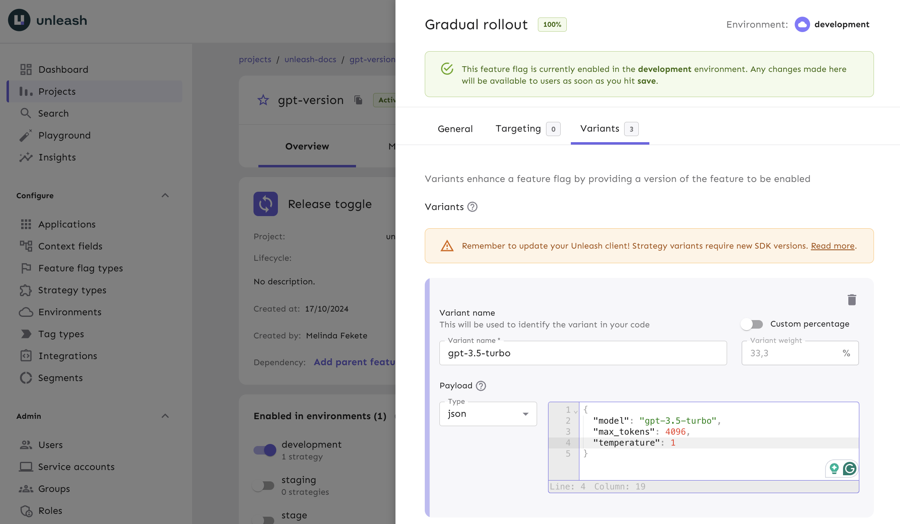

Many tech companies today are implementing some form of generative AI with LLMs into their products. This is usually a chatbot or a content generator.

The main way to interact with LLMs today is via a set of APIs, usually either OpenAI, Anthropic or aggregators like Groq. All the APIs usually have similar parameters, like:

-   `model`: The model and the specific version of the model to use.
-   `prompt`: The prompt to give to the LLM.

Because all these models vary a lot in their capabilities, chances are you'll be testing multiple models, and multiple versions of the same model, and multiple prompts.

This is where feature flags are super useful. And this is what we'll be doing in this tutorial.

We'll be starting with a basic chatbot. I know building a chatbot is a total cliché at this point, but it's a small, self-contained example that everyone knows how to interact with. You can take this example and apply it to any other use case where you need to interact with an LLM via an API.

First, clone the repo:

```sh
git clone https://github.com/alvinometric/feature-flags-ai
cd feature-flags-ai
```

Install the dependencies

```sh
npm install
```

Run the app

```sh
npm run dev
```

And you should see something like this:


This is a simple Sveltekit app with a chatbot UI. It doesn't really matter if you've never used Sveltekit before. It's similar to Next.js or Nuxt or SolidStart, where your file structure defines your routes.

The most important file for this tutorial is the `src/routes/api/chat/+server.js` file.

It creates an API endpoint at `/api/chat`. When your frontend sends a POST request to `/api/chat`, this is the code that handles it.

```javascript
import { createOpenAI } from "@ai-sdk/openai";
import { streamText } from "ai";
import { env } from "$env/dynamic/private";

const openai = createOpenAI({
    apiKey: env.OPENAI_API_KEY ?? "",
});

const variants = {
    variant1: {
        model: "gpt-3.5-turbo",
        max_tokens: 4096,
        temperature: 1,
    },
    variant2: {
        model: "gpt-4-turbo",
        max_tokens: 4096,
        temperature: 1,
    },
    variant3: {
        model: "gpt-4-vision-preview",
        max_tokens: 4096,
        temperature: 1,
    },
};

export const POST = async ({ request }) => {
    const { messages } = await request.json();
    const variant = variants["variant1"];
    const result = await streamText({
        model: openai(variant.model),
        messages,
        max_tokens: variant.max_tokens,
        temperature: variant.temperature,
    });
    return result.toDataStreamResponse();
};
```

This file is doing a few key things:

1. It sets up our OpenAI client with an API key.
2. It defines different AI model configurations in the `variants` object.
3. The `POST` function handles incoming chat requests.

When a request comes in, it:

-   Extracts the messages from the request body
-   Selects a variant (currently hardcoded to 'variant1')
-   Uses the OpenAI API to generate a response
-   Streams the response back to the client

The `streamText` function part of some utilities provided by Vercel's AI SDK, which helps deal with real-time streaming of the AI's responses and other AI-related tasks.

## Creating a feature flag with AI variants

Instead of hardcoding `variant1`, we want to use feature flags to dynamically choose which AI model to use. This will let us easily switch between models, test different configurations, or even do some A/B testing to see which model performs better for which task.

To implement this, we'll need to:

1. Set up a feature flag provider (we'll use Unleash).
2. Replace our static `variants` selection with feature flag calls.
3. Use the feature flag in our code to determine which AI model and settings to use for each request.

### Install a local feature flag provider

In this section, we’ll install Unleash, run the instance locally, log in, and create a feature flag. If you prefer, you can use other tools instead of Unleash, but you’ll need to update the code accordingly. The basic steps will probably be the same.

Use Git to clone the Unleash repository and Docker to build and run it. Open a terminal window and run the following commands:

```sh
git clone https://github.com/unleash/unleash.git
cd unleash
docker compose up -d
```

You will now have Unleash installed onto your machine and running in the background. You can access this instance in your web browser at [http://localhost:4242](http://localhost:4242).

Log in to the platform using these credentials:

```
Username: admin
Password: unleash4all
```

Click the ‘New feature flag’ button to create a new feature flag.


Create a new feature flag called `gpt-version`.

After that, and this the most important part, we need to add a variant to our feature flag.

What we'll do is hold all the model configurations in the feature flag variants.

So, we can take these model configurations:

```javascript
const variants = {
    variant1: {
        model: "gpt-3.5-turbo",
        max_tokens: 4096,
        temperature: 1,
    },
    variant2: {
        model: "gpt-4-turbo",
        max_tokens: 4096,
        temperature: 1,
    },
    variant3: {
        model: "gpt-4-vision-preview",
        max_tokens: 4096,
        temperature: 1,
    },
};
```

And add them into Unleash.



## Querying AI feature flags

Now let's go back to the code and grab our AI config from the feature flag that we just created.

First, install the Unleash Node.js client:

```sh
npm install unleash-client
```

Now, let's modify our `+server.js` file to use Unleash:

```javascript
import { initialize } from "unleash-client";
import { createOpenAI } from "@ai-sdk/openai";
import { streamText } from "ai";
import { env } from "$env/dynamic/private";

const openai = createOpenAI({
    apiKey: env.OPENAI_API_KEY ?? "",
});

const unleash = initialize({
    url: "http://localhost:4242/api/",
    appName: "my-ai-app",
    customHeaders: { Authorization: env.UNLEASH_API_KEY ?? "" },
});

export const POST = async ({ request }) => {
    const { messages } = await request.json();

    // Get the feature flag variant
    const variant = unleash.getVariant("gpt-versions");

    const result = await streamText({
        model: openai(variant.model),
        messages,
        max_tokens: variant.max_tokens,
        temperature: variant.temperature,
    });

    return result.toDataStreamResponse();
};
```

This setup uses the Unleash client to fetch the value of a feature flag called `gpt-versions`.

Now, instead of hardcoding 'variant1', we're dynamically choosing the AI model based on the feature flag variant.

This setup gives us a ton of flexibility. Want to roll out GPT-4 to 10% of your users? Easy. Need to quickly switch everyone back to GPT-3.5 because of a bug? No problem. You can do all of this from your Unleash dashboard without touching your code.

## Conclusion

Thanks for following along! You've learned one way to use feature flags to interact with AI models.
