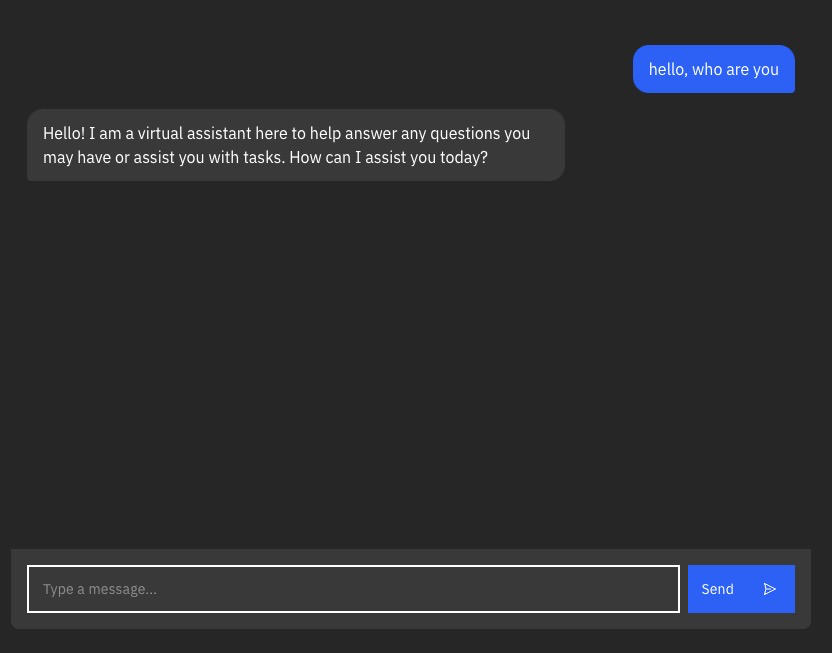
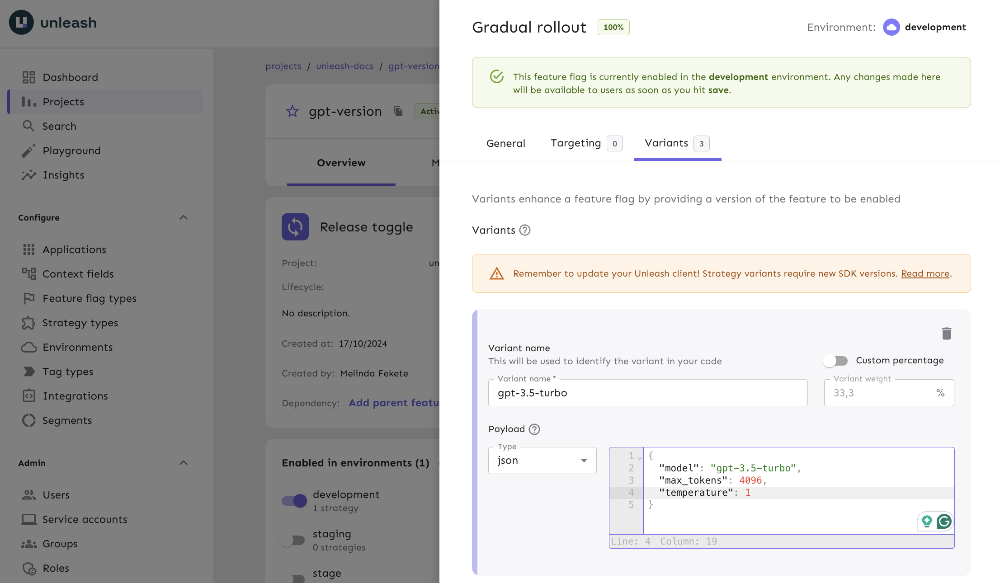

Hello,

Like many people in lots of tech companies today, you might be playing with generative AI and large language models (LLMs). You might even be integrating these AI technologies into your company's products, probably in the form of chatbots or content generators.

The main way to interact with LLMs today is via a set of APIs, usually either OpenAI, Anthropic or aggregators like Groq. Most of these APIs have similar parameters, like:

-   `model`: The model and the specific version of the model to use.
-   `prompt`: The prompt to give to the LLM.

Given how much these models vary in their capabilities, chances are you'll be testing multiple models, multiple versions of the same model, and multiple prompts.

This is where feature flags are super useful. They allow you to easily switch between different configurations. In this tutorial, we’ll explore how to use feature flags with AI models.

We'll start with a basic chatbot. I know building a chatbot is a total cliché at this point, but it's a small, self-contained example that everyone knows how to interact with. You can take this example and apply it to any other use case where you need to interact with an LLM via an API.

First, clone the repo:

```sh
git clone https://github.com/alvinometric/feature-flags-ai
cd feature-flags-ai
```

Install the dependencies:

```sh
npm install
```

Copy the `.env.example` file to a new `.env` file, and add your OpenAI API key to it:

```sh
OPENAI_API_KEY=sk-...
```

Run the app:

```sh
npm run dev
```

You should now see a chatbot UI, like this:



This is a simple SvelteKit app with a chatbot interface. If you’re not familiar with SvelteKit, it works similarly to frameworks like Next.js, Nuxt, or SolidStart, where your file structure defines the routing.

The most important file for this tutorial is the `src/routes/api/chat/+server.js` file.

It creates an API endpoint at `/api/chat`. When your frontend sends a POST request to `/api/chat`, this is the code that handles the request.

```javascript
import { createOpenAI } from "@ai-sdk/openai";
import { streamText } from "ai";
import { env } from "$env/dynamic/private";

const openai = createOpenAI({
    apiKey: env.OPENAI_API_KEY ?? "",
});

const variants = {
    variant1: {
        model: "gpt-3.5-turbo",
        max_tokens: 4096,
        temperature: 1,
    },
    variant2: {
        model: "gpt-4-turbo",
        max_tokens: 4096,
        temperature: 1,
    },
    variant3: {
        model: "gpt-4-vision-preview",
        max_tokens: 4096,
        temperature: 1,
    },
};

export const POST = async ({ request }) => {
    const { messages } = await request.json();
    const variant = variants["variant1"];
    const result = await streamText({
        model: openai(variant.model),
        messages,
        max_tokens: variant.max_tokens,
        temperature: variant.temperature,
    });
    return result.toDataStreamResponse();
};
```

This file is doing a few key things:

1. Sets up our OpenAI client with an API key.
2. Defines different AI model configurations in the `variants` object.
3. Handles incoming chat requests with the `POST` function.

When a request comes in, it:

-   Extracts the messages from the request body.
-   Selects a variant (currently hardcoded to 'variant1').
-   Uses the OpenAI API to generate a response.
-   Streams the response back to the client.

The `streamText` function is one of the utilities provided by [Vercel's AI SDK](https://sdk.vercel.ai/). It helps deal with the real-time streaming of the AI's responses.

## Creating a feature flag with AI variants

Instead of hardcoding `variant1`, we want to use feature flags to dynamically choose which AI model to use. This will let us easily switch between models, test different configurations, or even do some A/B testing to see which model performs better for which task. And we can do this without having to redeploy our app.

We can also disable it altogether if the upstream API stops working, or we run out of credits.

To implement this, we'll need to:

1. Set up a feature flag provider (we'll use Unleash).
2. Replace our static objects with dynamic feature flag variants.
3. Use the feature flag in our code to determine which AI model and settings to use for each request.

### Install a local feature flag provider

In this section, we’ll install Unleash, run the instance locally, log in, and create a feature flag. If you prefer, you can use other tools instead of Unleash, but you’ll need to update the code accordingly.

Use Git to clone the Unleash repository and Docker to build and run it. Open a terminal window and run the following commands:

```sh
git clone https://github.com/unleash/unleash.git
cd unleash
docker compose up -d
```

You now have Unleash installed on your machine and running in the background. You can access this instance in your web browser at [http://localhost:4242](http://localhost:4242).

Log in to the platform using these credentials:

```
Username: admin
Password: unleash4all
```

Click **New feature flag** to create a new feature flag, called `ai-model`.

After that, and this is the most important part, we need to add a variant to our feature flag.

Add a strategy to the feature flag in the `development` environment, in that strategy, create a variant for each of these model configurations:

```javascript
const variants = {
    variant1: {
        model: "gpt-3.5-turbo",
        max_tokens: 4096,
        temperature: 1,
    },
    variant2: {
        model: "gpt-4-turbo",
        max_tokens: 4096,
        temperature: 1,
    },
    variant3: {
        model: "gpt-4-vision-preview",
        max_tokens: 4096,
        temperature: 1,
    },
};
```

What we'll do is move all the model configurations from the code to the feature flag variants.



## Querying AI feature flags

Now let's go back to the code and grab our AI config from the feature flag that we just created.

First, install the Unleash Node.js client:

```sh
npm install unleash-client
```

Now, let's modify our `+server.js` file to use Unleash:

```javascript
import { initialize } from "unleash-client";
import { createOpenAI } from "@ai-sdk/openai";
import { streamText } from "ai";
import { env } from "$env/dynamic/private";

const openai = createOpenAI({
    apiKey: env.OPENAI_API_KEY ?? "",
});

const unleash = initialize({
    url: "http://localhost:4242/api/",
    appName: "my-ai-app",
    customHeaders: { Authorization: env.UNLEASH_API_KEY ?? "" },
});

export const POST = async ({ request }) => {
    const { messages } = await request.json();

    // Get the feature flag variant
    const variant = unleash.getVariant("ai-model");

    const result = await streamText({
        model: openai(variant.model),
        messages,
        max_tokens: variant.max_tokens,
        temperature: variant.temperature,
    });

    return result.toDataStreamResponse();
};
```

This setup uses the Unleash client to fetch the value of a feature flag called `ai-model`.

Now, instead of hardcoding `variant1`, we're dynamically choosing the AI model based on the feature flag variant.

This setup gives us a ton of flexibility.

Do you want to roll out GPT-4 to 10% of your users? Easy. Need to quickly switch everyone back to GPT-3.5 because of a bug? No problem.

You can do all of this from your Unleash dashboard without touching your code, and without needing to redeploy.

## Conclusion

Thanks for following along!

In this guide, we covered how to use feature flags to help you manage AI models.

That approach lets you switch between different model configurations, experiment with variations, and even roll out updates without needing to touch your code or redeploy. This gives you more control when experimenting with LLMs, and more power to respond to the unexpected things that will inevitably happen, like running out of credits or discovering a bug.
