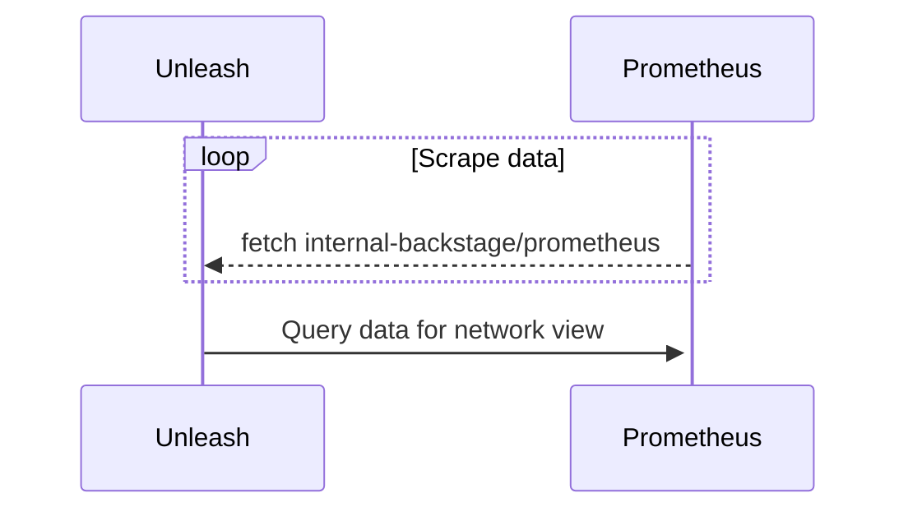

import Figure from '@site/src/components/Figure/Figure.tsx'

:::info Availability

The network view was released in Unleash 4.21. It is available to Pro and Enterprise users.

You must configure the [data source](#data-source) to activate the feature.

:::

The Unleash admin UI contains a **network view** as part of the admin configuration pages. This network view was designed to give you an overview and understanding of incoming requests to your Unleash instance. It makes it possible to pinpoint sources of sudden request surges, and can therefore also help you identify issues with SDK setups[^1].

The network view offers two different visualizations of the same data, known as the [network overview](#network-overview) and the [network traffic](#network-traffic) views.

Because Unleash doesn't store this kind of data itself, the network view requires you to configure an [external data source](#data-source) for the network overview to work. The network view is only available if you tell Unleash where it can find the data (refer to the [data source section](#data-source)).

The network view is intended to provide a simple and Unleash-centric overview that serves basic use cases. If you need detailed metrics and connection graphs, you may be better off using specialized network monitoring tools.

## Applications

Both the network overview and the network traffic diagrams show you **applications** that have made requests to the Unleash instance. An **application** is defined as anything that sends requests to the [Unleash client API](/reference/api/unleash/client), the [Unleash front-end API](front-end-api.md),  the Unleash admin API, or any other API that Unleash exposes. This includes [Unleash SDKs](./sdks/index.md), [Unleash Edge](/docs/generated/unleash-edge.md), the [Unleash proxy](/docs/generated/unleash-proxy.md), and even the admin UI.

### "unknown" applications

Requests that come from Unleash SDKs and other official Unleash applications will always have an application name defined. But you might sometimes see some applications listed as "unknown" in the diagrams.

This happens when Unleash receives requests that don't contain an application name header (`UNLEASH_APPNAME`). This can happen, for instance, if you make HTTP requests from the command line to test Unleash connections or if you write your own HTTP client for Unleash that doesn't provide an application name.

Because Unleash can't separate these based on their application names, all "unknown" clients will get lumped together as one application in the overview.

## Network overview

The network overview is a diagram that shows the Unleash instance and known [applications](#applications) that have connected to it within the last five minutes. [Unknown applications](#unknown-applications) are not shown.

Each application shown on the diagram has:
- An application name
- the average number of requests per second (_req/s_) that we have registered over the last five minutes.

<Figure caption="The network overview shows applications that have recently made requests to Unleash. In this figure, it's showing three different instances of the Unleash proxy connected to Unleash. Each instance has an average of 20 req/s." img="/img/network-overview.png"/>

## Network traffic

The network traffic diagram is a line chart that presents requests that have used the most network traffic over the last six hours, grouped by client and base URL for the request. For legibility, this chart only shows the ten groups that have caused the most traffic over the last six hours.

Unleash aggregates requests by **client** (using application name) and **base URL**. Base URLs are batched together using the **first two** path segments following the `/api` part of the URL. In essence, that means:

1. Separate requests by API: Admin API requests are separate from client API requests.
2. Within each of these groups, group all requests by their next URL path segment. For instance: `/client/features` and `/client/features/feature-a` are grouped together, while `/client/register` and `/admin/features` are separate groups.


<Figure caption="The network traffic chart plots req/s on the Y axis and time on the X axis. Requests are bundled per endpoint per application." img="/img/network-traffic.png"/>

## Data source

:::info Prometheus and other sources

The network view was written to be used with [Prometheus](https://prometheus.io/) and is therefore compatible with Prometheus' API.

Other services that offer the same capabilities and the same API may work as substitutes, but we make no guarantees.

This section will refer to the external source as Prometheus for simplicity.

:::

The network view uses an external Prometheus-like API to create diagrams. Because of this, Unleash will not enable the network view feature unless you set the `PROMETHEUS_API` environment variable.

The `PROMETHEUS_API` environment variable should point to the base path of the Prometheus installation, and Prometheus should be configured to get its data from Unleash's [internal backstage API](api/legacy/unleash/internal/prometheus.md). This can for example be done via a scraping job[^2]:

```yaml title="Scraping job for Unleash metrics"
  - job_name: unleash_internal_metrics
    metrics_path: /internal-backstage/prometheus
    static_configs:
      - targets: ['unleash-url']
```

This setup means that there is a mutual dependency between Unleash and Prometheus, where Prometheus regularly fetches data from Unleash's backstage API and Unleash fetches and displays this data when you use the network view. This diagram provides a visual representation of that.




[^1]: For instance: when using Unleash in an API setting, a common mistake is to instantiate a new SDK for every request instead of sharing a single instance across requests. This would be visible in the network overview graph as a large number of requests from the same app.

[^2]: How to set up Prometheus to collect metrics from that API is outside of the scope of this document.
