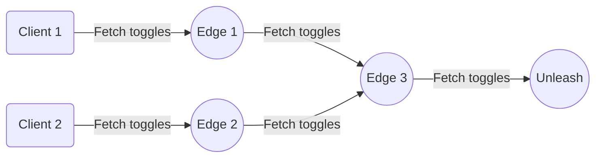

:::note Availability

**Plan**: [Enterprise](https://www.getunleash.io/pricing) | **Unleash version**: `7.3+`

:::

[Enterprise Edge Self-hosted](/unleash-edge#enterprise-edge-self-hosted) gives you full control over the infrastructure, networking, and data persistence of your Edge nodes. It allows you to keep flag data in specific geographic regions, operate in air-gapped environments, and meet specific infrastructure requirements.

This guide covers deploying Enterprise Edge self-hosted on your infrastructure.

## License

To self-host Enterprise Edge, you need a license key. Contact your customer success representative to obtain or upgrade your license.

### Infrastructure requirements

Edge runs as a single binary or container. Minimum requirements per instance:

| Resource | Minimum | Recommended |
|----------|---------|-------------|
| CPU | 0.1 cores | 1 core |
| Memory | 64 MB | 128 MB |
| Disk | 100 MB | 500 MB (with persistence) |

## Modes of operation

Unleash Edge supports two distinct modes of operation:

- **Edge mode**: Connects to an upstream node (Unleash instance or another Edge). It synchronizes feature flags and streams metrics back to the upstream server. This is the standard operating mode.
- **Offline mode**: Runs without a connection to an upstream Unleash instance. It loads feature flags from a local file (bootstrap file). This is primarily used for local development or strictly air-gapped testing.

See [Operating modes](/unleash-edge/configure#operating-modes) for configuration options.



## Daisy chaining

Daisy chaining allows you to connect an Edge instance to another upstream Edge instance rather than directly to the Unleash API. This architecture is useful for multi-cloud deployments or extreme scale scenarios where a central Edge node bridges the gap between regional nodes and the main Unleash instance.

graph LR
  A(Client 1) -->|Fetch toggles| C((Edge 1))
  B(Client 2) -->|Fetch toggles| D((Edge 2))
  C-->|Fetch toggles| E((Edge 3))
  D-->|Fetch toggles| E
  E-->|Fetch toggles| F((Unleash))

To configure daisy chaining, point the downstream Edge's `UPSTREAM_URL` to the upstream Edge instance instead of Unleash. Metrics propagate upstream through the chain automatically.

## Quickstart with Docker

Unleash Edge is distributed as a Docker image.

To pull the image from Docket Hub, run:

```shell
docker pull unleashorg/unleash-edge-enterprise:latest
```

To run Edge in a container, provide your upstream URL and a client token for bootstrapping.

```
docker run -it -p 3063:3063 \
  -e UPSTREAM_URL=https://<your-unleash-instance>.com \
  -e TOKENS=<your_client_token> \
  unleashorg/unleash-edge-enterprise:<version> edge
```

Once Edge is running, connect your SDKs by pointing them to `http://localhost:3063/api`:

```javascriptconst
unleash = initialize({
  url: 'http://localhost:3063/api',
  appName: 'my-app',
  customHeaders: { Authorization: '<your_client_token>' },
});
```

For a more hands-on guide on setting up Edge locally and connecting an SDK, follow our [Unleash Edge](/guides/unleash-edge-quickstart) quickstart guide.

## Production deployment

For production setups, we recommend deploying a minimum of two Edge instances behind a load balancer. This ensures high availability during updates or unexpected failures.

If running multiple replicas, you must configure a shared persistence layer so all instances share the same cold-start data. See [Reliability and persistence](#reliability-and-persistence) for details.

Add persistence and resource limits:

```shell
docker run -d \
  --name unleash-edge \
  -p 3063:3063 \
  -e UPSTREAM_URL=https://your-unleash-instance.com \
  -e TOKENS=your-client-token \
  -e REDIS_URL=redis://your-redis:6379 \
  --memory=128m \
  --cpus=1 \
  unleashorg/unleash-edge-enterprise:latest edge
```

### Kubernetes

For Kubernetes deployments, we recommend using the official [Helm charts](https://github.com/Unleash/helm-charts). Ensure you update the `image.repository` in your `values.yaml` to point to the Enterprise image tag.

### Reliability and persistence

Enterprise Edge serves feature flag evaluations from in-memory state to ensure low latency. However, you should configure a persistence layer to ensure reliability during restarts.

Persistence stores validated license, token, and feature data. If the upstream Unleash instance is unavailable when Edge restarts (for example, during a network partition), Edge can restore its state from the persistence layer and immediately begin serving traffic.
Without persistence, a restarted Edge node must contact the upstream Unleash instance before it can serve any traffic.

We recommend that you use Redis for production environments, especially with multiple Edge replicas.

### Persistence options

| Option | Env var / CLI flag | Use case |
| ----- | ----- | ----- |
| **Redis** | `REDIS_URL --redis-url` | Recommended for production. Persists snapshots to a shared Redis cluster. Ideal for multi-replica setups. |
| **Amazon S3** | `S3_BUCKET_NAME --s3-bucket-name` | Edge writes periodic snapshot files to S3. Suitable when a Redis service is not available but durable storage is required. |
| **Local File** | `BACKUP_FOLDER --backup-folder` | Intended for **development only**. Not recommended for production or multi-replica environments. |


## Configuration

Unleash Edge is configured primarily via environment variables. See [Configure self-hosted Edge](/unleash-edge/configure) for the complete reference.

### Essential configuration

| Environment Variable | CLI Argument | Description |
| ----- | ----- | ----- |
| `UPSTREAM_URL` | `--upstream-url` | The URL of your Unleash instance. Note: Do not include the `/api` suffix. |
| `TOKENS` | `--tokens` | Comma-separated list of client tokens used to bootstrap the cache. |
| `STREAMING` | `--streaming` | Set to `true` to enable real-time updates. |
| `PORT` | `--port` | The HTTP port Edge listens on (Default: `3063`). |
| `RUST_LOG` | N/A | Log level configuration (e.g., `warn,unleash_edge=debug`). |

For the complete list of environment variables including TLS, CORS, and observability options, see [Environment variables](/unleash-edge/configure#environment-variables).

## Performance and sizing

Unleash Edge is designed to scale linearly with CPU resources. The throughput depends heavily on the size of your feature toggle dataset (number of feature flags and strategies).

### Capacity guidelines

Based on internal benchmarks, you can estimate capacity requirements using the following tiers. These figures assume a standard dataset size (approx. 100kB).

| CPU Allocation | Est. RPS (Requests Per Second) | Memory Footprint (Approx) |
| ----- | ----- | ----- |
| 0.1 vCPU | ~600 RPS | ~7 MiB |
| 1.0 vCPU | ~6,900 RPS | ~7 MiB |
| 4.0 vCPU | ~25,000 RPS | ~10 MiB |
| 8.0 vCPU | ~40,000 RPS | ~15 MiB |

**Note**: Actual performance varies based on hardware generation and network conditions. We recommend allocating 1 vCPU per 5,000 expected RPS as a conservative baseline for production planning.

## Tokens

Edge relies on Unleash API tokens to validate access and sync configuration. The specific token configuration depends on your operating mode.

## Startup tokens (Edge mode)

When running in [Edge mode](#modes-of-operation), the instance requires at least one valid [backend token](/concepts/api-tokens-and-client-keys#backend-token) at startup to connect to the upstream Unleash instance.
This token serves two purposes: bootstrapping the cache and defining the maximum access scope for the Edge instance.

Providing startup tokens, allows Edge to hydrate its data ahead of time. This ensures Edge can respond to frontend API requests immediately without needing to fetch data on demand.
If you are running Edge behind a load balancer and using the frontend API, setting startup tokens is necessary to ensure predictable responses.

- Environment variable: `TOKENS`
- CLI flag: `--tokens`

## Scope validation and narrowing

Edge enforces strict scope validation based on the startup token. It refuses requests from SDKs that attempt to access projects or environments outside the scope of the startup token.

Incoming requests must match the environment and project access specified in the initial tokens. For example, if your startup token grants access to `project-a` and `project-b` in development, an SDK request for `project-c` in development or any projects in production will be rejected.

If you start Edge with a wildcard token (for example, `*:development`), clients can use narrower tokens (such as, `project-a:development`). Edge filters the feature list to grant access only to the specific project requested by the client.

## Offline tokens

When running in [Offline mode](#modes-of-operation), there is no upstream instance to validate tokens against. You must explicitly configure which tokens are valid for backend and frontend access.

- **Backend SDKs**: Use `CLIENT_TOKENS` (or `--client-tokens`). These tokens grant access to the `/api/client/features` endpoint.
- **Frontend SDKs**: Use `FRONTEND_TOKENS` (or `--frontend-tokens`). These tokens grant access to the `/api/frontend` and `/api/proxy` endpoints.

## Pre-trusted tokens

:::note Availability

Edge version**: `19.10+`

:::

Pre-trusted tokens allow you to bypass upstream validation for specific frontend tokens. This is useful for high-scale scenarios where you want to authorize known frontend clients without incurring the latency of an upstream validation check.

- Environment variable: `PRETRUSTED_TOKENS`
- CLI flag: `--pretrusted-tokens`

Supported formats:
- Standard Unleash token: A valid Unleash frontend token (e.g.,` *:development.969e...`).
- Legacy Proxy token: A token in the format `some-secret@environment`. Note: When using legacy-style tokens, you must also configure at least one standard backend token via the `TOKENS` variable that covers the specified environment. This ensures Edge can fetch the actual feature data for that environment from the upstream server.

## Frontend token limitations

Frontend tokens can be used with the `/api/frontend` and `/api/proxy` endpoints, but they cannot be used to fetch feature updates from the upstream Unleash instance.

To ensure frontend tokens return correct data, the features they access must already be present in the Edge cache. You must pass at least one backend token (using `TOKENS`) at startup that covers the same environment and projects as your frontend tokens.

If a frontend token requests data that is not currently cached, Edge returns `HTTP 511 Network Authentication Required`. The response body will indicate which project and environment requires a valid client token to hydrate the cache.

### Health and readiness

Edge exposes internal endpoints to verify the state of the application. These are useful for load balancer health checks and Kubernetes probes.

- **Health check**: `GET /internal-backstage/health`
  - Returns `200 OK` if the process is running.
- **Ready check**: `GET /internal-backstage/ready`
  - Returns `200 OK` only when Edge has successfully synced with the upstream and the cache is populated.

### Metrics

:::note Availability

Edge version**: `19+` | Unleash version `5.9+`

:::

Edge batches metrics from connected SDKs and pushes them upstream to Unleash. It also exposes its own application metrics compatible with Prometheus.

- **Endpoint**: `GET /internal-backstage/metrics`

## Security

### Protect internal endpoints

Endpoints under `/internal-backstage/` expose operational data and must not be publicly accessible.

**Option 1: Reverse proxy**

```nginx
location /internal-backstage/ {
    deny all;
    return 403;
}
```

**Option 2: Disable at startup**

```shell
-e DISABLE_METRICS_ENDPOINT=true \
-e DISABLE_TOKENS_ENDPOINT=true \
-e DISABLE_FEATURES_ENDPOINT=true
```

### Network access control

```shell
# Allow specific CIDRs
--allow-list="10.0.0.0/8,192.168.0.0/16"

# Block specific CIDRs
--deny-list="203.0.113.0/24"
```

## Troubleshooting

**Edge returns 511 for frontend requests**

Frontend token doesn't have cached data. Ensure a client token is configured that covers the same project and environment.

**Edge won't start**

Check that `UPSTREAM_URL` doesn't include `/api` suffix. Correct: `https://unleash.example.com`. Incorrect: `https://unleash.example.com/api`.

**Tokens rejected**

Ensure tokens match the expected format and have appropriate permissions in Unleash. Token scope must match or be narrower than startup tokens.

## Development guide

You can find a complete [development guide](https://github.com/Unleash/unleash-edge/blob/main/docs/development-guide.md) for Unleash Edge on GitHub.