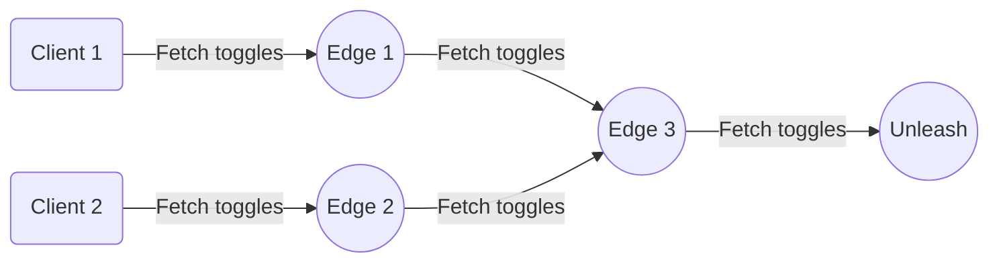

:::note Availability

**Plan**: [Enterprise](https://www.getunleash.io/pricing) | **Unleash version**: `7.3+`

:::

[Enterprise Edge Self-hosted](/unleash-edge#enterprise-edge-self-hosted) gives you full control over the infrastructure, networking, and data persistence of your Edge nodes. It allows you to keep flag data in specific geographic regions, operate in air-gapped environments, and meet specific infrastructure requirements.

This guide covers deploying Enterprise Edge self-hosted on your infrastructure.

## License

To self-host Enterprise Edge, you need an Unleash Enterprise instance and a license key that includes Enterprise Edge. Contact your customer success representative to obtain or upgrade your license.

## Quickstart with Docker

Unleash Edge is distributed as a Docker image.

To pull the image from Docker Hub, run:

```shell
docker pull unleashorg/unleash-edge-enterprise:latest
```

To run Edge in a container, provide your upstream URL and a backend token for bootstrapping.

```
docker run -it -p 3063:3063 \
  -e UPSTREAM_URL=https://<your-unleash-instance>.com \
  -e TOKENS=<your_client_token> \
  unleashorg/unleash-edge-enterprise:<version> edge
```

Once Edge is running, connect your SDKs by pointing them to `http://localhost:3063/api`:

```javascript
const unleash = initialize({
  url: 'http://localhost:3063/api',
  appName: 'my-app',
  customHeaders: { Authorization: '<your_client_token>' },
});
```

For a more hands-on guide on setting up Edge locally and connecting an SDK, follow our [Unleash Edge](/guides/unleash-edge-quickstart) quickstart guide.

## Infrastructure requirements

Edge runs as a single binary or container. Minimum requirements per instance:

| Resource | Minimum | Recommended |
|----------|---------|-------------|
| CPU | 0.1 cores | 1 core |
| Memory | 64 MB | 128 MB |
| Disk | 100 MB | 500 MB (with persistence) |

## Modes of operation

Unleash Edge supports two distinct modes of operation:

- **Edge mode**: Connects to an upstream node (Unleash instance or another Edge). It synchronizes feature flags and streams metrics back to the upstream server. This is the standard operating mode.
- **Offline mode**: Runs without a connection to an upstream Unleash instance. It loads feature flags from a local file (bootstrap file). This is primarily used for local development or strictly air-gapped testing.

See [Configure the operating mode](/unleash-edge/configure#configure-the-operating-mode) for configuration options.



## Daisy chaining

Daisy chaining allows you to connect an Edge instance to another upstream Edge instance rather than directly to the Unleash API. This architecture is useful for multi-cloud deployments or extreme scale scenarios where a central Edge node bridges the gap between regional nodes and the main Unleash instance.


To configure daisy chaining, point the downstream Edge's `UPSTREAM_URL` to the upstream Edge instance instead of Unleash. Metrics propagate upstream through the chain automatically.

## Production deployment

For production setups, we recommend deploying a minimum of two Edge instances behind a load balancer. This ensures high availability during updates or unexpected failures.

Unleash Edge runs evaluations from memory for speed, but it requires a persistence layer to survive restarts when the upstream is unavailable. To guarantee the resilience benefits of Edge, you must configure a persistence layer.

If an Edge node restarts and cannot contact the upstream Unleash server, it will fail to start unless it can load valid data from a persistence layer.

When running multiple Edge replicas, you must configure a shared persistence layer, such as Redis, so all instances share the same cold-start data.

#### Persistence options

| Option | Env var / CLI flag | Use case |
| ----- | ----- | ----- |
| **Redis** | `REDIS_URL --redis-url` | Recommended for production. Persists snapshots to a shared Redis cluster. Ideal for multi-replica setups. |
| **Amazon S3** | `S3_BUCKET_NAME --s3-bucket-name` | Edge writes periodic snapshot files to S3. Suitable when a Redis service is not available but durable storage is required. |
| **Local file** | `BACKUP_FOLDER --backup-folder` | Intended for **development only**. Not recommended for production or multi-replica environments. |

#### Deployment example

```shell
docker run -d \
  --name unleash-edge \
  -p 3063:3063 \
  -e UPSTREAM_URL=https://your-unleash-instance.com \
  -e TOKENS=your-client-token \
  -e REDIS_URL=redis://your-redis:6379 \
  --memory=128m \
  --cpus=1 \
  unleashorg/unleash-edge-enterprise:latest edge
```

### Kubernetes

For Kubernetes deployments, we recommend using the official [Helm charts](https://github.com/Unleash/helm-charts). Ensure you update the `image.repository` in your `values.yaml` to point to the Enterprise image tag.

## Configuration

Unleash Edge is configured primarily via environment variables. See [Configure self-hosted Edge](/unleash-edge/configure) for the complete reference.

### Essential configuration

| Environment Variable | CLI Argument | Description |
| ----- | ----- | ----- |
| `UPSTREAM_URL` | `--upstream-url` | The URL of your Unleash instance. Note: Do not include the `/api` suffix. |
| `TOKENS` | `--tokens` | Comma-separated list of backend tokens used to bootstrap the cache. |
| `STREAMING` | `--streaming` | Set to `true` to enable real-time updates. |
| `PORT` | `--port` | The HTTP port Edge listens on (Default: `3063`). |
| `RUST_LOG` | N/A | Log level configuration (e.g., `warn,unleash_edge=debug`). |

For the complete list of environment variables including TLS, CORS, and observability options, see [Configure](/unleash-edge/configure).

## Performance and sizing

Unleash Edge is designed to scale linearly with CPU resources. The throughput depends heavily on the size of your feature toggle dataset (number of feature flags and strategies).

### Capacity guidelines

Based on internal benchmarks, you can estimate capacity requirements using the following tiers. These figures assume a standard dataset size (approx. 100kB).

| CPU Allocation | Est. RPS (Requests Per Second) | Memory Footprint (Approx) |
| ----- | ----- | ----- |
| 0.1 vCPU | ~600 RPS | ~7 MiB |
| 1.0 vCPU | ~6,900 RPS | ~7 MiB |
| 4.0 vCPU | ~25,000 RPS | ~10 MiB |
| 8.0 vCPU | ~40,000 RPS | ~15 MiB |

**Note**: Actual performance varies based on hardware generation and network conditions. We recommend allocating 1 vCPU per 5,000 expected RPS as a conservative baseline for production planning.

## Tokens

Edge relies on Unleash API tokens to validate access and sync configuration. The specific token configuration depends on your operating mode.

### Edge mode

When running in [Edge mode](#modes-of-operation), you must provide at least one valid [backend token](/concepts/api-tokens-and-client-keys#backend-tokens) at startup using the `TOKENS` variable. This token serves two critical functions:

- **Authentication**: Validates the Edge instance against the upstream Unleash server or the persistence layer.
- **Scope definition**: Defines the maximum set of data the Edge instance can access.

Edge enforces strict scoping based on this token. It will only sync flags for the [projects](/concepts/projects) and [environments](/concepts/environments) included in the startup token.

For example:
- **Broader access startup token**: If a client connects with a token that is a subset of the startup token (for example, the startup token has `*:development`, and the client has `project-a:development`), the request is accepted. Edge filters the response to show only `project-a`.
- **Narrower or different access startup token**: If a client requests data outside the startup token's scope (for example, requesting production data when Edge only has development, or requesting `*` when Edge only has `project-a`), the request is rejected with `403 Forbidden` or `511 Network Authentication Required`.

:::tip Recommendation
Bootstrap Edge with a wildcard token for the specific environment (for example, `*:development.some-secret`). This ensures the Edge instance has all data for that environment, allowing it to serve any client request for that environment instantly.
:::

- Environment variable: `TOKENS`
- CLI flag: `--tokens`

### Offline mode

When running in [Offline mode](#modes-of-operation), there is no upstream instance to validate tokens. You must explicitly configure which tokens are valid:

- **[Backend SDKs](/sdks#backend-sdks)**: Use `CLIENT_TOKENS` (or `--client-tokens`). Grants access to `/api/client/features`.
- **[Frontend SDKs](/sdks#frontend-sdks)**: Use `FRONTEND_TOKENS` (or `--frontend-tokens`). Grants access to `/api/frontend` and `/api/proxy`.

### Pre-trusted tokens

:::note Availability
Edge version: `19.10+`
:::

If migrating from the legacy Unleash Proxy, you can use `PRETRUSTED_TOKENS` to support legacy secrets (for example, `secret-123@development`) without updating your frontend clients.

Note: You must still provide a standard backend token via `TOKENS` that covers the same environment. This ensures Edge can fetch the feature data required by the legacy token.

## Health and readiness

Edge exposes internal endpoints to verify the state of the application. These are useful for load balancer health checks and Kubernetes probes.

- **Health check**: `GET /internal-backstage/health`
  - Returns `200 OK` if the process is running.
- **Ready check**: `GET /internal-backstage/ready`
  - Returns `200 OK` only when Edge has successfully synced with the upstream and the cache is populated.

## Metrics

:::note Availability

**Edge version**: `19+` | Unleash version `5.9+`

:::

Edge batches metrics from connected SDKs and pushes them upstream to Unleash. It also exposes its own application metrics compatible with Prometheus.

- **Endpoint**: `GET /internal-backstage/metrics`

## Security

### Protect internal endpoints

Endpoints under `/internal-backstage/` expose operational data and must not be publicly accessible.

**Option 1: Reverse proxy**

```nginx
location /internal-backstage/ {
    deny all;
    return 403;
}
```

**Option 2: Disable at startup**

```shell
-e DISABLE_METRICS_ENDPOINT=true \
-e DISABLE_TOKENS_ENDPOINT=true \
-e DISABLE_FEATURES_ENDPOINT=true
```

### Network access control

```shell
# Allow specific CIDRs
--allow-list="10.0.0.0/8,192.168.0.0/16"

# Block specific CIDRs
--deny-list="203.0.113.0/24"
```

## Troubleshooting

**Edge returns 511 for frontend requests**

Frontend token doesn't have cached data. Ensure a backend token is configured that covers the same project and environment.

**Edge won't start**

Check that `UPSTREAM_URL` doesn't include `/api` suffix. Correct: `https://unleash.example.com`. Incorrect: `https://unleash.example.com/api`.

**Tokens rejected**

Ensure tokens match the expected format and have appropriate permissions in Unleash. Token scope must match or be narrower than startup tokens.

## Development guide

You can find a complete [development guide](https://github.com/Unleash/unleash-edge/blob/main/docs/development-guide.md) for Unleash Edge on GitHub.